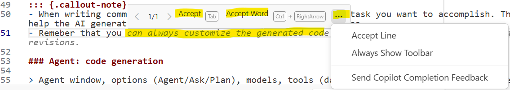
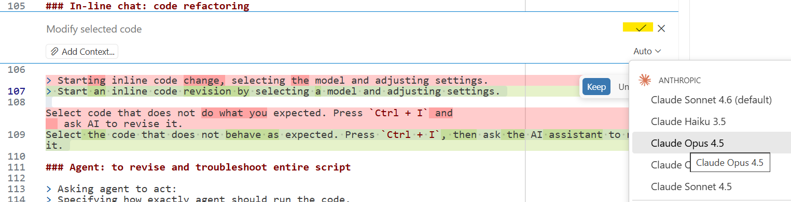

## Where to start?

Setup [working folders properly](/day1/working-folder.qmd):

1. Copy folder with `ex01-explore-positron` to your working directory
2. Open `ex01-explore-positron` in Positron
3. Follow the instructions below

All examples are available:

- on GitHub: <https://github.com/worldbank/ai4coding-examples>
- on One Drive (WB only): [ai4coding-examples](https://worldbankgroup-my.sharepoint.com/:f:/g/personal/ebukin_worldbank_org/IgCXQVakSxEpT7VJFmKp_qtnAXx8RX9iemnwfGwITkEA3bE?e=U08qTX)

For this example, data is already contained in the folder, but you can also
download it from [ai4coding-data](https://worldbankgroup-my.sharepoint.com/:f:/r/personal/ebukin_worldbank_org/Documents/AI/AI-course-2026-April/ai4coding-data?csf=1&web=1&e=ITG6Sk)
and place it your course folder.

## Prompt examples and example details

### Step 1. Create a script file in your editor

Let us call the file: `second-positron-do-with-ai.do`.

### Step 2. Inline suggestions

Write comments at the top of the file and save it. Then proceed adding the details
   and use in-line suggestions.

```stata
/*
Goal: To learn how to use Positron AI assistance to write Stata code and
execute it. This code should include: data loading, descriptive statistics,
regression analysis, and visualization.

In details, these steps are:
*/
```

::: {.callout-note}
### Tips

- Inline suggestions pop out automatically if you have enabled GitHub Copilot and Positron Assistant.

- if it does not work, check: [Positron Assistant Completions](https://positron.posit.co/assistant-completions.html)

- Remember that there might be many suggestions and you can customize them:

{width="550px"}
:::

### Agent: code generation

Use the Chat window to ask for code generation for the steps outlined in the
comments. For example: add following details to the file and ask AI to implement them:

```stata
/*

I want to:
1. Load exemplary data from data/raw/
2. Summarize descriptive statistics of all variables
3. Run a regression of income on individual characteristics
4. Create a scatter plot of income vs age
5. Create a box plot of income vs education levels
6. Save regression results and figures in an Excel file
*/
```

Open Assistant chat and type:

```{.markdown filename="Prompt"}
Develop code that implements the steps outlined in the comments for the file `my-first-do-in-positron.do`. Do not run the code.

```
- Add context by clicking on  `+ Add context` and selecting the do file you are working on or adding console context with .

- Choose the model  and adjust the type of agent  if needed.

- Press `Send`

Inspect the code and choose which parts to accept or reject

Use `run` button to execute the code

::: {.callout-note}
### Tips

- Interrupt request if it goes wrong.
- Switch between different models (e.g. GPT-4, Claude)
- Choose the right mode: chat, agent, edit or plan.
- Monitor the context window size

  - When it is too big, AI forgets or optimizes it, potentially losing some important details.
  - Use `Show Chat Debug View` to monitor the context and how it changes with each interaction.
:::

### In-line chat: code refactoring

Select the code that does not behave as expected. Press `Ctrl + I`, then ask the AI assistant to revise it.

- Select model and adjust settings if needed.
- If happy, accept the changes. If not, provide feedback and ask for another revision.
- Can be used with free models.

::: {.callout-note}

:::

### Agent: to revise and troubleshoot entire script

Iterate by adding requirements in the chat or in comments and ask AI to
implement those step by step. For example:

```{.markdown filename="Prompt"}
Create a new regression adding a fixed-effect of time and implementing
the robust standard errors. Then run the stata code.
```

```{.markdown filename="Prompt"}
Remember: Use #executeCode to run stata code in console autonomously to check whether it works. Resolve execution errors in an agent mode using #executeCode and running all needed code in console.
```

::: {.callout-warning}
**Important:** Be explicit about how Stata code should be executed.

AI may sometimes choose the wrong approach (for example, creating a Python script to call Stata) instead of using Positron’s built-in `#executeCode` command. When this happens, AI is preoccupied about how to run Stata rather than what code to write, which leads to suboptimal code generation.

To avoid this, always include the instruction about using `#executeCode` in your prompt when asking for code generation or revision in agent mode.
:::
