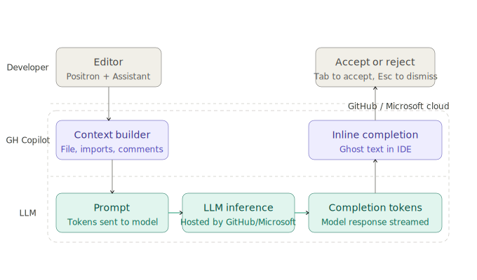
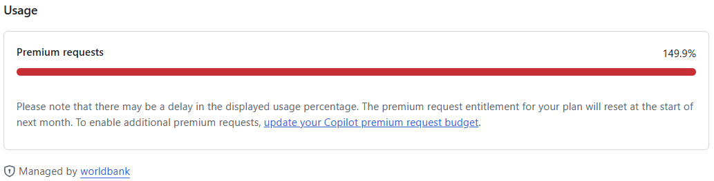

## Software Setup {.small-slide}

[Follow instructions on software setup and verification]{.alert} in [prerequisites](../prerequisites/index.qmd).

- Thanks to our IT team, all required software is available for installation via
**Software Center** on WB laptops:
- **Stata 19+ MP**, **Positron** (latest), **R 4.5.3+**, **Python 3.13+**, **Quarto 1.9+**, and **Git 2.52+**
- Everything except Stata is **free and open source** - [no license required.]{.highlight}

If any problems arise: follow the [troubleshooting guide](../prerequisites/common-problems.qmd) or contact [ITHelp@worldbankgroup.org](mailto:ITHelp@worldbankgroup.org).

## GitHub Account Setup {.small-slide}

**Why?** To use version control, collaborate with colleagues, and access GitHub Copilot AI features.

[1. Create account]{.fg}

- Sign up at [github.com/signup](https://github.com/signup)
- Use your [**personal email**]{.alert} (not WB email)

[2. Join WB organization]{.fg}

- Submit [eServices request](https://worldbankgroup.service-now.com/wbg/en/join-github-organization-account-request?id=wbg_sc_catalog&sys_id=910e1739db1a54903c5960ab13961912&table=sc_cat_item&searchTerm=github) to join [github.com/worldbank](https://github.com/worldbank)

- Accept invitation email within 7 days

## Get GitHub Copilot: WB vs. Private {.tiny-slide}

**Why?** To get AI code assistance in Positron and GitHub.

|  | Private Free | WB Organization | Private Copilot Pro | Private Copilot Pro+ |
|------|:------------:|:---------------:|:-------------------:|:--------------------:|
| **Cost** | Free | Free (WB-funded) | ~$10/mo | ~$39/mo |
| **Premium requests/mo** | 50 | 300 | 500 | 1,500 |
| **Advanced models** (Claude, GPT) | ❌ | ✅ | ✅ | ✅ |
| **Inline completions** | ⚠️ Old models | ✅ | ✅ | ✅ |
| **Overage billing** | N/A | [Chargeback process](https://github.com/worldbank/ospo/blob/main/docs/copilot/premium-request-chargeback.md) | Credit card | Credit card |

::: {.callout-important}
You can only have [**one active plan**]{.alert}. WB access **automatically cancelles and refunds** your private subscription. Switching back requires re-subscribing and is possible in the end of a month.
:::

## How GitHub Copilot works? {.small-slide}

::::: {.columns}
:::: {.column width="60%"}

::::

:::: {.column width="40%"}
- GH hosts **foundational models** (Claude, GPT, Gemini, etc.)
- **Context** from your code is optimized and sent to models as **tokens**
- User sends messages - **requests**
- Each interaction costs **one premium request**
::::
:::::

## Premium Requests Limits {.small-slide}

[What are premium requests?]{.fg} — Every chat/agent interaction interaction with advanced models (Claude Sonette, GPT-5+) consumes (x1-x3) **premium request**.

::::: {.columns}
:::: {.column width="50%"}
### Monthly included allowances

| Plan | Included req/mo |
|------|:-----------:|
| WB org | 300 |
| Private Copilot Pro | 500 |
| Private Copilot Pro+ | 1,500 |

::::

:::: {.column width="50%"}
### Hit the limit?

Set a **budget** (~$0.04/request):

- **WB plan →** [chargeback process](https://github.com/worldbank/ospo/blob/main/docs/copilot/premium-request-chargeback.md) (manager approval + budget code)

- **Private plan →** [GitHub Billing → Budgets](https://github.com/settings/billing/budgets)

- **Usage →** [GitHub Settings → Copilot](https://github.com/settings/copilot/features)

[[When you've used all included requests (100%), advanced AI features stop working.]{.warning} Basic inline completions still work (older models).]{.smallest}

::::
:::::

## Access Levels at a Glance {.small-slide .center}

| Setup | Repos | Copilot AI |
|----------|---------|------------|
| No GitHub account | Public only | ❌ None |
| Personal account (free) | + Personal repos | ⚠️ Old models only |
| + Copilot Pro (private) | + Personal repos | ✅ 500 premium req/mo |
| + Copilot Pro+ (private) | + Personal repos | ✅ 1,500 premium req/mo |
| + WB org member | + WB repos | ⚠️ No premium requests |
| + WB Copilot access | + WB repos | ✅ 300 premium req/mo |
| + WB chargeback | + WB repos | ✅ 300 + extra at $0.04/req |

[Recommended: WB Copilot access + good prompting.]{.highlight}
[For most use cases, 300 premium requests per month is sufficient with thoughtful usage.]{.note}

## Github @ World Bank is more than copilot {.small-slide}

[**Why to use GitHub @ World Bank?**]{.fg}

- It is a modern standard of research and collaboration.

- Github integration improves your code, version control, and collaboration standard leading to better quality, transparency, and reproducibility.

  - Request access to [github.com/worldbank](https://github.com/worldbank) on [eServices](https://worldbankgroup.service-now.com/wbg/en/join-github-organization-account-request?id=wbg_sc_catalog&sys_id=910e1739db1a54903c5960ab13961912&table=sc_cat_item&searchTerm=github)

- WB Open source [https://opensource.worldbank.org/](https://opensource.worldbank.org/) — builds open source communities and shares open data, software, and research to advance transparent, evidence-based progress toward the SDGs.
  - [make your code public](https://worldbankgroup.service-now.com/wbg/en/github-open-source-public-repository-request?id=wbg_sc_catalog&sys_id=63bb210e1b272610185ceb17b04bcbfa) as part of WB Open Source.

- [Viva Engage](https://engage.cloud.microsoft/main/groups/eyJfdHlwZSI6Ikdyb3VwIiwiaWQiOiIxNzA2ODQ1NDcwNzIifQ): stay connected with the community.

- Support: [github@worldbank.org](mailto:github@worldbank.org)

## Positron Assistant {.small-slide}

It is needed to connect GitHub Copilot to Positron and use AI features in the editor and chat.

::::: {.columns}
:::: {.column width="50%"}
### Enable

1. Settings (`Ctrl+,`) → search `positron.assistant.enable` → ☑️
2. Reload Positron

### Connect to Copilot

1. `Ctrl+Shift+P` → *Configure Language Model Providers*
2. Select **GitHub Copilot**
3. Sign in → complete GitHub OAuth

::::

:::: {.column width="50%"}
### Use

- Click chat icon in sidebar (or `Chat: Open Chat`)
- Type a question → press Enter
- Also provides inline code completions as you type

::: {.callout-tip}
You can also sign in via the **Accounts** icon (bottom-left of Activity Bar).
:::
::::
:::::

## Support & Links {.small-slide}

| Need | Contact |
|------|---------|
| Software installation issues | [ITHelp@worldbankgroup.org](mailto:ITHelp@worldbankgroup.org) |
| GitHub / Copilot access | [github@worldbank.org](mailto:github@worldbank.org) |
| WB premium request chargeback | [github@worldbank.org](mailto:github@worldbank.org) + manager CC |

**Documentation:**

- Course materials: [worldbank.github.io/ai4coding](https://worldbank.github.io/ai4coding)
- Positron docs: [positron.posit.co](https://positron.posit.co/)
- GitHub Copilot docs: [docs.github.com/copilot](https://docs.github.com/en/copilot)
- WB GitHub overview: [github.com/worldbank/ospo](https://github.com/worldbank/ospo)
