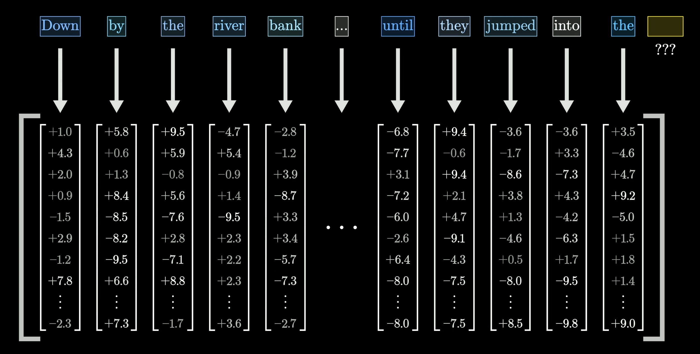
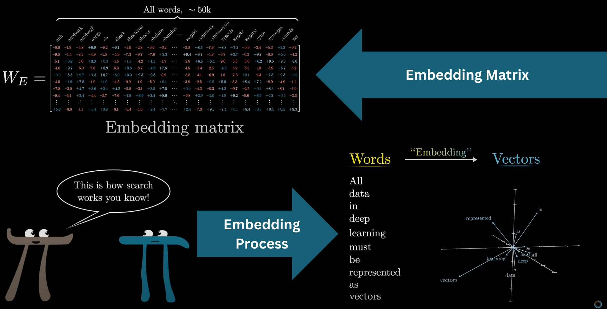
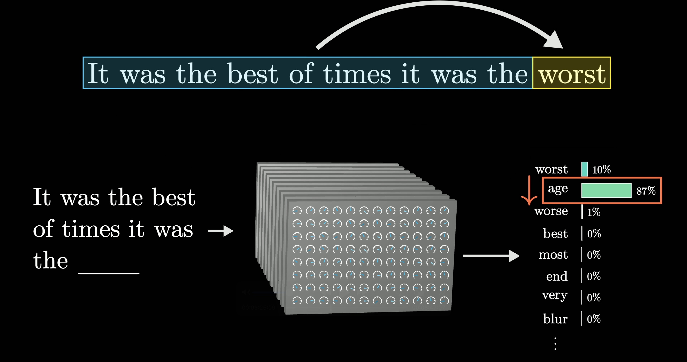
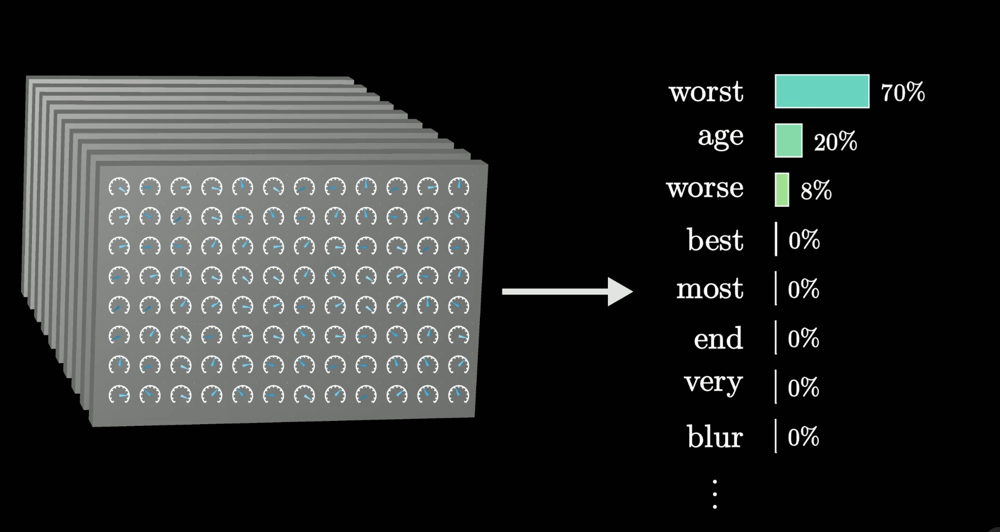
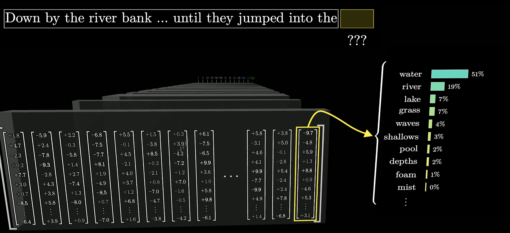

## Core AI-related concepts worth knowing about {.small-slide .center}

- 💻 IDE: Integrated Development Environment, e.g. Positron, RStudio, VSCode and more.

- 🤖 AI assistants:

  -  Local software: Positron Assistant, VS Code GitHub Copilot, Claude Code, Copilot CLI ...
  -  Cloud-based providers: GitHub Copilot, MAI, Anthropic Claude API, ...

- 📚 Context: information that AI uses to generate responses.

- 🔢 Tokens: pieces of text that LLMs process.

- ❓ Requests: prompts, instructions.

- 🧠 LLMs: Large Language Models, e.g. GPT, Claude and more.

- ❌ Hallucinations: when AI generates incorrect or fabricated information.

- 🧑‍🤝‍🧑 Agents, skills, tools, hooks, plugins, and more (for day 2).

## Integrated Development Environment (IDE)

:::: {.columns}
::: {.column width="42%" .smaller}

An IDE is the [workspace for coding and executing data analysis]{.fg}:

- a code editor
- a console / terminal
- project navigation
- testing/debugging
- Git and extensions
- AI assistance and more...

There are many IDEs, both with user interfaces (UIs) and as command-line interfaces (CLIs).

[Most are made for programming. **Positron, RStudio, and JupyterLab** — for data science.]{.highlight .center}

:::

::: {.column width="58%" style="position: relative; min-height: 560px;"}
{.absolute .stacked-gif top="0" right="0" width="300"}

{.absolute .stacked-gif top="60" left="0" width="300"}

{.absolute .stacked-gif top="120" right="20" width="300"}

{.absolute .stacked-gif top="180" left="20" width="300"}

{.absolute .stacked-gif top="240" right="0" width="300"}

{.absolute .stacked-gif top="300" left="0" width="300"}

:::
::::

::: footer
**Those are:** [Positron](https://positron.posit.co/) \| [VS Code](https://code.visualstudio.com/) \| [Cursor](https://www.cursor.com/) \| [Claude Code](https://claude.ai/download) \| and more...
:::

## User-IDE-Assistant: workflow intuition

:::: {.columns .smallest}
::: {.column width="50%"}

- 💻 **Code, data, and analysis** stay inside the IDE on the user's computer.
-  **Positron Assistant** works in the IDE as a middleman that connects user, IDE, and cloud-based AI services.

-  **GitHub Copilot** is a cloud-based AI orchestrator: coordinates the assistant and LLMs, submits prompts to the LLMs, pre-processes responses before sending them back to the assistant.

- 🔢 **The LLM**:

  - ingests the **prompt as text**,
  - converts it **into tokens**,
  - **embeds tokens as numeric vectors**,
  - **performs inference** to generate a tokenized response, decodes tokens, and
  - **responds back to the assistant**.

- ✅ **The user controls and decides** if they want to accept, edit, or reject the suggested code.

:::
::: {.column width="50%"}

:::
::::

{.absolute bottom="0" right="0" height="650px"}

## Context

:::: {.columns}
::: {.column width="50%" .small}

- 🧠 **Context** is key for accurate AI responses.
- Every message, file, and code snippet **adds to the context**.
- 🔧 Context is assembled by the IDE **cumulatively**.
- 📏 Size is measured in **tokens**.
- Context has layers: **system prompt** (hidden instructions that steer the LLM's behavior in Copilot and Positron) vs **user prompt** (your visible messages and attached files).

[**Be mindful of context size and content.**]{.warning}

⚠️ LLMs have a max context window (4k–2M tokens) — exceeding it leads to information loss.

:::
::: {.column width="50%"}
{width="100%" .center}
:::
::::

## Context saturation

- ⚠️ When the context window fills up, old context is **pushed out**, causing [information loss]{.fg} and reduced quality.

- 🗜️ Assistants may **compress context** via LLM's summarization — but this is [suboptimal]{.warning}: key details can be lost.

[**Best practices:**]{.highlight}

- 📁 Explicitly attach only relevant files.
- 🔄 Start a new session often.
- 📝 Ask AI to summarize conversation in a file to preserve key context, curate it, and use it as a starting point for the new conversation.
- ⚙️ Use system instructions, prompt files, and skills **(day 2)**.

## IDE + AI assistant: data risks

- 💾 **Data/secrets in console** → context exposed to model

- 📂 **LLM may include data files** (`csv`, `json`, `txt`) → data exposed to model

- 🔐 **Source code** → code is context, can leak

- 💥 **Insecure/destructive actions** → always review before accepting

[**Be cautious with sensitive data. Review all suggestions. Ask LLM to explain its suggestions.** [Follow recommendations to safeguard data](/methods/safeguard-data.qmd)]{.warning}

[Use AI responsibly and securely: <https://ai.worldbank.org/risk-mitigation>]{.highlight .warning .center}

## Tokens and embeddings
::: {.small}
- 🔢 **Tokens** are text units (words, subwords) forming the LLM **vocabulary** (GPT-3: 50k tokens; Claude speculated ~ 200k).
- 🧠 Each token is **embedded** as a numeric vector (GPT-3: 12,288 dimensions) — a sentence becomes a matrix of vectors.
:::

::: columns
::: {.column width="48%"}
{width="100%"}
:::
::: {.column width="2%"}
:::
::: {.column width="48%"}
{width="100%" .fragment}
:::
:::

::: {.footer}
From [Neural Networks Series](https://www.3blue1brown.com/?topic=neural-networks) by [3Blue1Brown](https://www.3blue1brown.com/) and [NN-Full Video Course](https://www.youtube.com/playlist?list=PLZHQObOWTQDNU6R1_67000Dx_ZCJB-3pi)
:::

## LLM Training
::: {.small}
- 🧠 **LLMs** are trained on massive text datasets (GPT-3: ~300B tokens / 570GB; modern models: >15T tokens).
- The model **learns to predict the next token** given previous tokens, updating its **weights** via **backpropagation**.
:::

::: columns
::: {.column width="48%"}
{width="100%" .fragment .center}
:::
::: {.column width="2%"}
:::
::: {.column width="48%"}
{width="100%" .fragment .center}
:::
:::

::: {.footer}
From [Neural Networks Series](https://www.3blue1brown.com/?topic=neural-networks) by [3Blue1Brown](https://www.3blue1brown.com/) and [NN-Full Video Course](https://www.youtube.com/playlist?list=PLZHQObOWTQDNU6R1_67000Dx_ZCJB-3pi)
:::

## LLMs are probabilistic

- LLMs respond with a distribution of likely next words and then **sample** one using a decoding strategy (e.g., **Temperature** or **Top-k** sampling).

{ width="100%" .center}

::: {.footer}
From [Neural Networks Series](https://www.3blue1brown.com/?topic=neural-networks) by [3Blue1Brown](https://www.3blue1brown.com/) and [NN-Full Video Course](https://www.youtube.com/playlist?list=PLZHQObOWTQDNU6R1_67000Dx_ZCJB-3pi)
:::

## LLMs are context-dependent

- Responses depend on the **context** of the prompt.
- Context **size** and **quality** affect accuracy.
- Claude Sonnet/Opus: 64k–2M token context window (GPT-3 had 8k).

{width="100%" .center}

::: {.footer}
From [Neural Networks Series](https://www.3blue1brown.com/?topic=neural-networks) by [3Blue1Brown](https://www.3blue1brown.com/) and [NN-Full Video Course](https://www.youtube.com/playlist?list=PLZHQObOWTQDNU6R1_67000Dx_ZCJB-3pi)
:::

## LLM inference

- The process of generating responses based on the input prompt, which contains all the context.

{width="80%" .center}

::: footer
Adapted from [10.48550/arXiv.2408.02549](https://arxiv.org/abs/2408.02549)
:::

## Hallucinations {.small-slide}

[Hallucinations]{.fg} occur when an LLM generates text that is fluent, confident, and **wrong**. Common causes: insufficient or irrelevant context, training data biases or gaps, over-generalization of learned patterns.

::: {.columns}
::: {.column width="50%"}
Hallucination patterns

  - **Fake** citations
  - **Wrong** but close facts
  - **Entity** blending
  - **Overconfident** extrapolation: correctly reasoning partway through a problem, then guessing the rest as
      if it were known.
  - **Recency** failures

:::

::: {.column width="50%"}
[**Mitigation:**]{.highlight}

- Provide [more context]{.fg}.
- **Ask for step-by-step reasoning**.
- **Verify** with external sources.
- **Use fresh agents to fact-check and verify** results asking to re-reading sources.
:::
:::

## Day 2 outlook: Agents, tools, and skills

We will focus **Day 2** on advanced AI features that enrich context and mitigate hallucinations:

- 🔧 **Tools** — connect LLMs to your file system, APIs, applications, databases, and the Internet.

- 📝 **Prompt files** and **custom instructions** — pre-load specific context and steer or template LLM responses.

- 🗺️ **Plan mode** — break down complex tasks into smaller steps, discuss implementation with the LLM, and execute an actionable plan.

- 🧩 **Skills** — knowledge that AI plugs into context when it encounters a specific problem.

- 🤖 **Agents** — AI-driven programs that autonomously execute tasks by orchestrating tools, skills, and APIs sequentially.

## Would you like to read/watch more about LLMs?

Check out:

- 3Blue1Brown's
  - [Neural Networks Series](https://www.3blue1brown.com/?topic=neural-networks)

  - or [YouTube playlist](https://www.youtube.com/playlist?list=PLZHQObOWTQDNU6R1_67000Dx_ZCJB-3pi)
