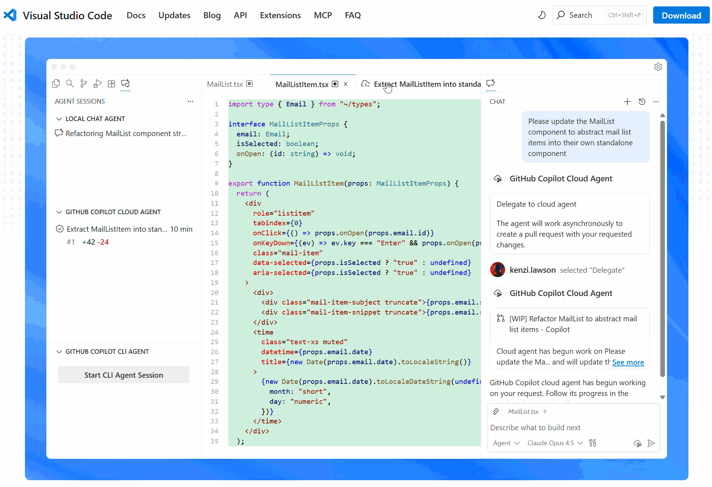
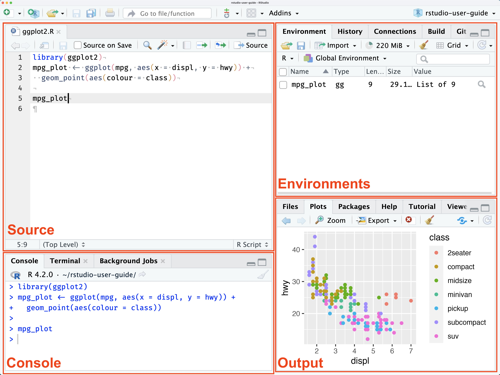
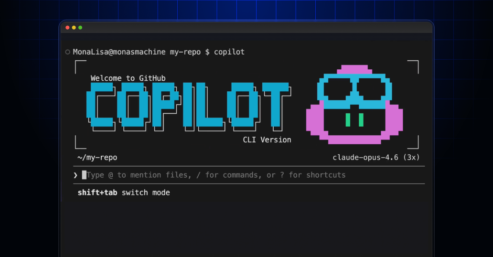
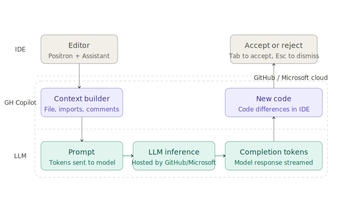
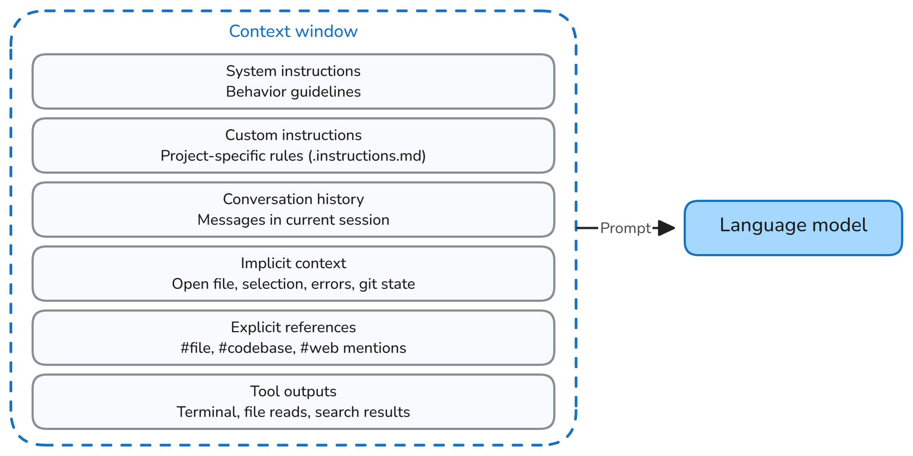
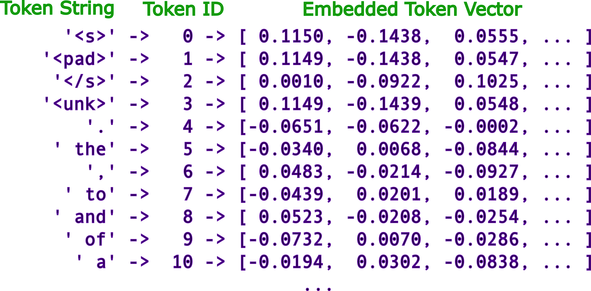
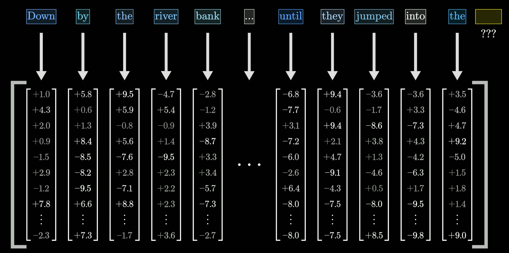
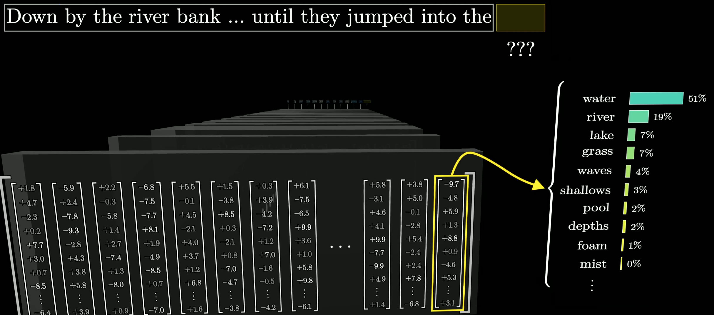
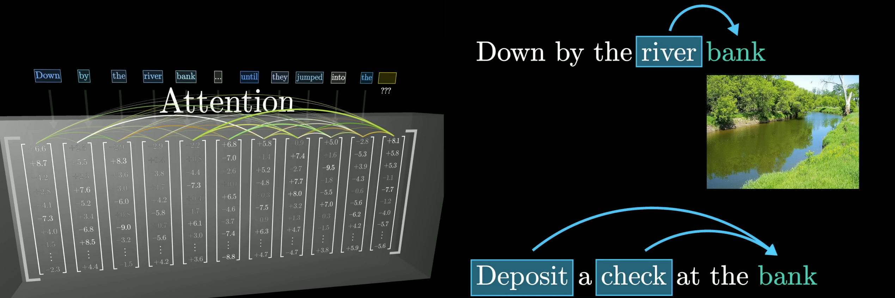

## Core concepts worth knowing about

- 💻 IDE: Integrated Development Environment, e.g. Positron, RStudio, VSCode and more.

- 🤖 AI assistants: e.g. GitHub Copilot, Copilot CLI, MAI, Claude Code and more.

- 📚 Context: information that AI uses to generate responses.

- 🔢 Tokens: pieces of text that LLMs processes.

- ❓ Requests: prompts, instructions.

- 🧠 LLMs: Large Language Models, e.g. GPT-4, Gemini Pro, Claude 2 and more.

- ❌ Hallucinations: when AI generates incorrect or fabricated information.

- 🧑‍🤝‍🧑 Agents, skills, tools, hooks, plugins, and more (for day 2).

## Integrated Development Environment (IDE)

:::: {.columns}
::: {.column width="42%" .smaller}

is the workspace for coding

- a code editor
- a console / terminal
- project navigation
- testing/debugging
- Git and extensions
- AI assistance and more...

There are many IDEs, with user interface (UI) and as a command-line interfaces (CLIs)

[Most are made for programming. Positron, R Studio and JupyterLab--for data science.]{.highlight .center}

:::

::: {.column width="58%" style="position: relative; min-height: 560px;"}
{.absolute .stacked-gif top="0" right="0" width="260"}

{.absolute .stacked-gif top="80" left="0" width="260"}

{.absolute .stacked-gif top="160" right="20" width="260"}

{.absolute .stacked-gif top="240" left="20" width="260"}

{.absolute .stacked-gif top="320" right="0" width="260"}

{.absolute .stacked-gif top="400" left="0" width="260"}

:::
::::

::: footer
**Those are:** [Positron](https://positron.posit.co/) \| [VS Code](https://code.visualstudio.com/) \| [Cursor](https://www.cursor.com/) \| [Claude Code](https://claude.ai/download) \| and more...
:::

## IDE and AI assistants: work together

:::: {.columns}
::: {.column width="40%"}

- 💻 **Code, data, and execution** stay inside the IDE.

- 🧠 **Copilot** gathers relevant context and prepares it as text for the model.

- 🔢 **The model processes the request** by converting text into tokens and generating a response.

:::

::: {.column width="60%"}

- ✅ **The user stays in control** and can accept, edit, or reject the suggested code

:::
::::

{.absolute bottom="50" right="0" width="650px" }

## IDE + AI assistant: data risks

- 💾 **Data/secrets in console** → context exposed to model
- 📂 **LLM includes data files** (`csv`, `json`, `txt`) → data exposed to model
- 🔐 **Source code/IP** → code is context, can leak
- 💥 **Insecure/destructive actions** → always review before accepting

[**Be cautious with sensitive data. Review all suggestions. Ask LLM to explain its suggestions.**]{.warning}

[Use AI responsibly and securely: <https://ai.worldbank.org/risk-mitigation>]{.highlight .warning .center}

## Context

:::: {.columns}
::: {.column width="40%"}

- 🧠 **Context** is key for accurate AI responses.
- Every message, file, and code snippet adds to the context.
- 🔧 Context is assembled by the IDE **cumulatively**.

[**Be mindful of context size and content.**]{.warning}

:::
::: {.column width="60%"}
- 📏 Size is measured in **tokens**.
- ⚠️ LLMs have a max context window (64k–1M tokens) — exceeding it drops oldest context, risking information loss.

:::
::::

{.absolute bottom="0" right="0" width="650px" }

## Token

- 🔢 **Tokens** are pieces of text (words, subwords, characters) that LLMs process.

::: {.footer}
Figure adopted from [Alignment Forum: LLM Basics](https://www.alignmentforum.org/posts/pHPmMGEMYefk9jLeh/llm-basics-embedding-spaces-transformer-token-vectors-are)
:::

## LLMs: Large Language Models (1)

- 🧠 **LLMs** are AI models trained on vast text data to match patterns and similarities between text resulting in the prediction of the next word.

::: {.footer}
From "LLM explained briefly" by 3Blue1Brown <https://youtu.be/LPZh9BOjkQs>
:::

## LLMs: Large Language Models (2) are probabilistic

- Respond with a distribution of likely next words.

::: {.footer}
From "LLM explained briefly" by 3Blue1Brown <https://youtu.be/LPZh9BOjkQs>
:::

## LLMs: Large Language Models (3) are context-dependent

- Responce depnds on the context.

::: {.footer}
From "LLM explained briefly" by 3Blue1Brown <https://youtu.be/LPZh9BOjkQs>
:::
