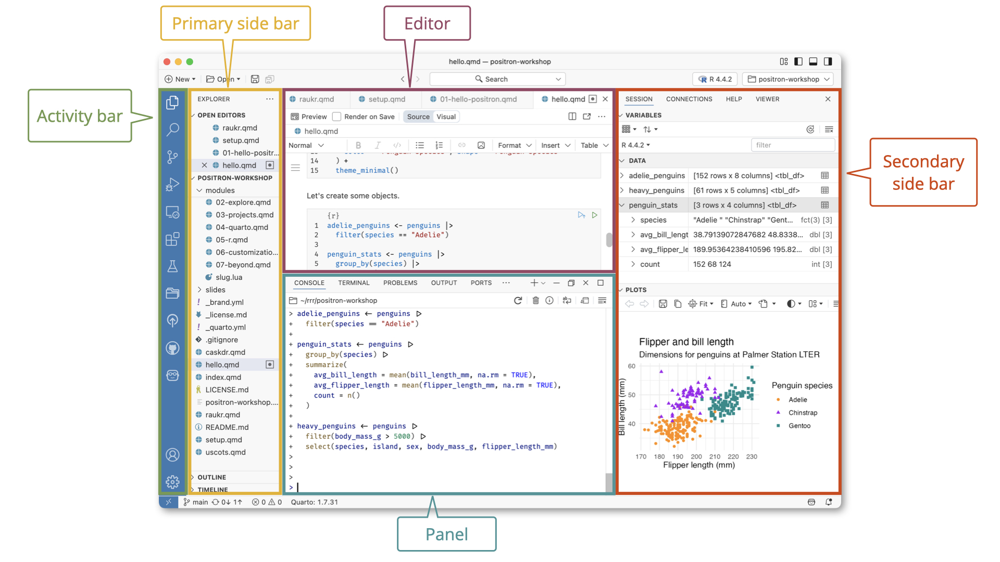
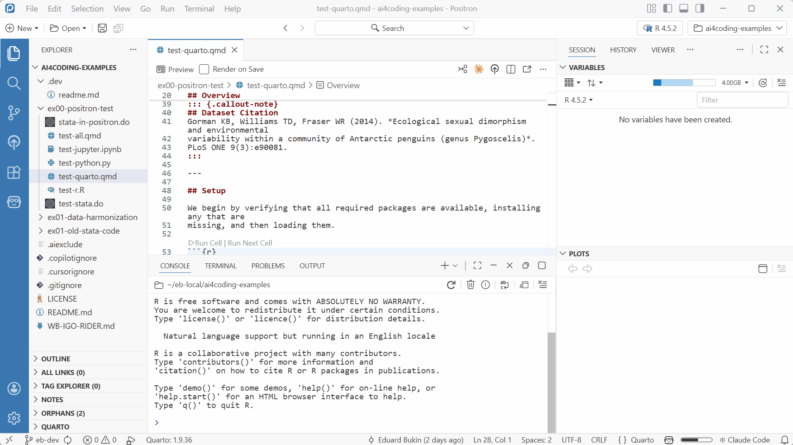
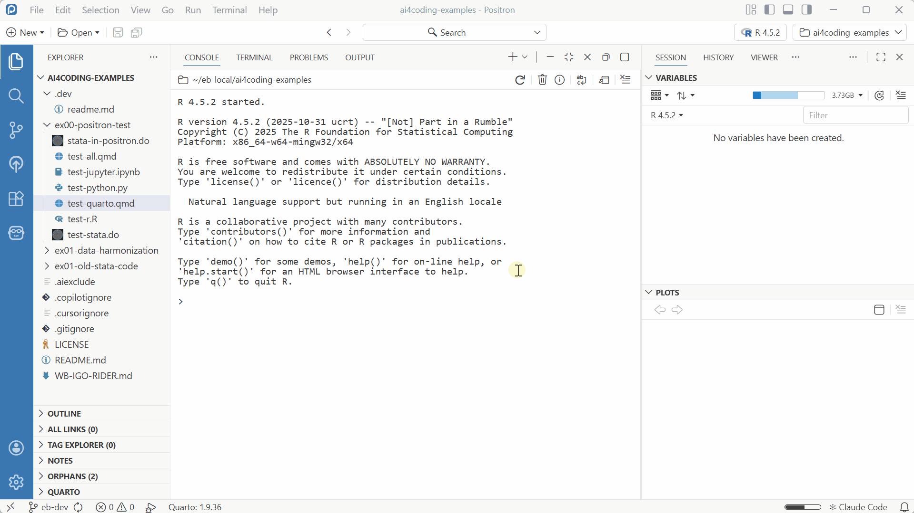
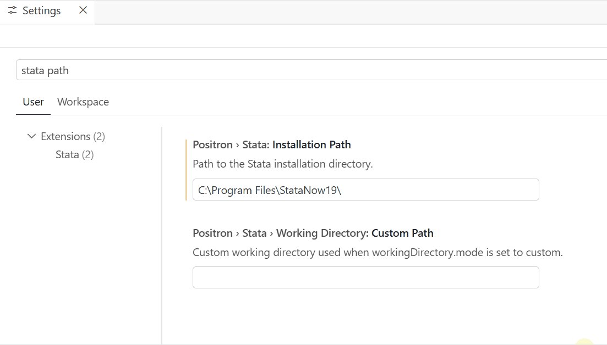

Key concepts are:

- Positron IDE:

  - panels and layouts
  - file explorer, editor, and extensions
  - command palette and settings

- Workflow basics:

  - working folder, console, terminal, session, data viewer, help pane, and more

- Assistant:

  - authentication
  - workflow: chat, agents, conversations, and LLMs

## Positron IDE Overview

> Adapted from Positron UI <https://positron.posit.co/layout.html>

{fig-alt="Positron IDE with labeled regions: Activity Bar on the far left, Primary Side Bar to its right, Editor in the center, Panel below the editor, and Secondary Side Bar on the right."}

- The **Activity Bar** provides quick access to switch between core views such as Explorer, Search, [Source Control](https://positron.posit.co/git.html), and [Extensions](https://positron.posit.co/extensions.html).

- The **Primary Side Bar** is on the left by default and shows you different views depending on what you have chosen in the Activity Bar. When you choose the Explorer icon, this pane provides the File Explorer to navigate your project directory and the outline. When you choose the Assistant icon, this pane provides access to [Positron Assistant](https://positron.posit.co/assistant.html).

- The **Editor** is in the center by default, and is where you write your code. For editor controls, refer to [VS Code Editor Basics](https://code.visualstudio.com/docs/editing/codebasics).

- The **Panel** is below the editor by default and contains the fully interactive, integrated Console as well as the [Terminal](https://code.visualstudio.com/docs/terminal/basics). You can also access logs from [Output](https://positron.posit.co/troubleshooting.html) channels in the Panel.

- The **Secondary Side Bar** is on the right by default. You can switch between the **Session** pane (where you can explore the [variables](https://positron.posit.co/variables-pane.html) you have defined and the [plots](https://positron.posit.co/plots-pane.html) you have created), the [**Connections**](https://positron.posit.co/connections-pane.html) pane, the [**Help**](https://positron.posit.co/help-pane.html) pane, the **History** pane, and the **Viewer** pane.

The **Title Bar** at the very top of the window shows the active file and project, along with window controls. Below it, the **Top Bar** provides global project tools such as file search, the project switcher, and the [interpreter selector](https://positron.posit.co/managing-interpreters.html#active-interpreter-session) with the ability to start, stop, and switch interpreters. The **Status Bar** at the bottom of the window displays details such as your git branch, language mode, [Quarto version](https://positron.posit.co/quarto.html), and cursor position.

### Layout customization

{fig-alt="Positron IDE showing how panels can be rearranged by dragging and toggled in and out of view using commands."}

Positron offers flexible layout options to suit a variety of development workflows. Almost every component can be rearranged by dragging.

### Command Palette

Command Palette - `Ctrl+Shift+P` - <https://positron.posit.co/command-palette.html> - is your gateway to all Positron features. It provides quick access to commands, settings, and more. For example, you can open files, run code, manage git, and interact with the assistant all from the Command Palette.

{fig-alt="Positron IDE showing how to access settings through the command palette."}

Try:

- `Ctrl+Shift+P` → type "Open file"
- `Ctrl+Shift+P` → type "Assistant: Configure Language Model Providers"
- `Ctrl+Shift+P` → type "Preferences: Open Settings (UI)" and search for "Stata" to find all related settings in one place.

### Settings

Settings can be accessed through:

- `Ctrl+Shift+P` (Command Palette) > search for "Preferences: Open Settings (UI)"
- or through the menu `File > Preferences > Settings`
- or `Ctrl+,`.

Here you can customize your Positron experience, including enabling the Assistant and configuring GitHub Copilot.

> Settings marked with a vertical line are modified from their default values in your IDE. You can click "Gear > Reset" button next to each setting to revert it to the default value.

> {fig-alt="Positron IDE showing how to reset settings to their default values."}

### Read/watch more

- UI <https://positron.posit.co/layout.html>

- Extensions <https://positron.posit.co/extensions.html>

- Data analysis <https://positron.posit.co/data-explorer.html>

::: panel-tabset

## A quick tour



## Exploratory Data Analysis (R)



## Quarto Document (Python)



:::

## Workflow overview

- Open/create a working folder
- Create your script or notebook and start coding
- Execute code.
- Use console directly
- Explore plots
- Data viewer
- Help pane for documentation

{fig-alt=" Positron IDE showing a workflow of opening a folder, creating a script, writing code, executing it, and exploring the output in the console, plots pane, data viewer, and help pane."}

## Assistant + GitHub Copilot: Setup and Overview

To use the assistant's AI features, you need to [Enable Positron Assistant](https://positron.posit.co/assistant-getting-started.html#step-1-enable-positron-assistant) and [Configure GitHub Copilot](https://positron.posit.co/assistant-getting-started.html#step-2-configure-language-model-providers).

This can be done as follows:

- `Ctrl+Shift+P` → "Preferences: Open Settings (UI)" → search `positron.assistant.enable` → ☑️

Other settings to consider:

- `positron.assistant.showTokenUsage.enable` - to show token usage details in the assistant chat
- `positron.assistant.toolDetails.enable` - to show tool usage details in the assistant chat

Assistant permits you to use AI for inline code suggestions and chat-based help.
See videos below for a quick tour or follow along with the course examples.

### Read/watch more

- AI tools <https://positron.posit.co/assistant.html>

::: panel-tabset

## What can you do with assistant?



## AI-Powered Data Science in Positron



:::
