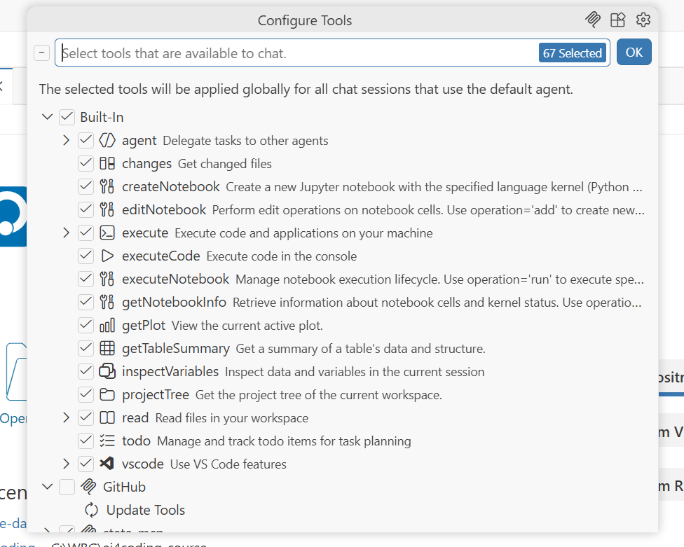
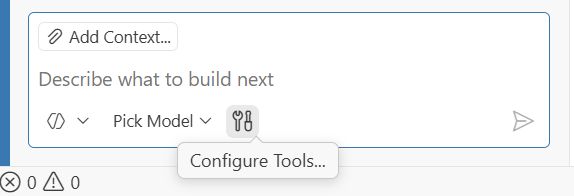
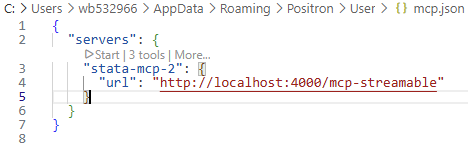
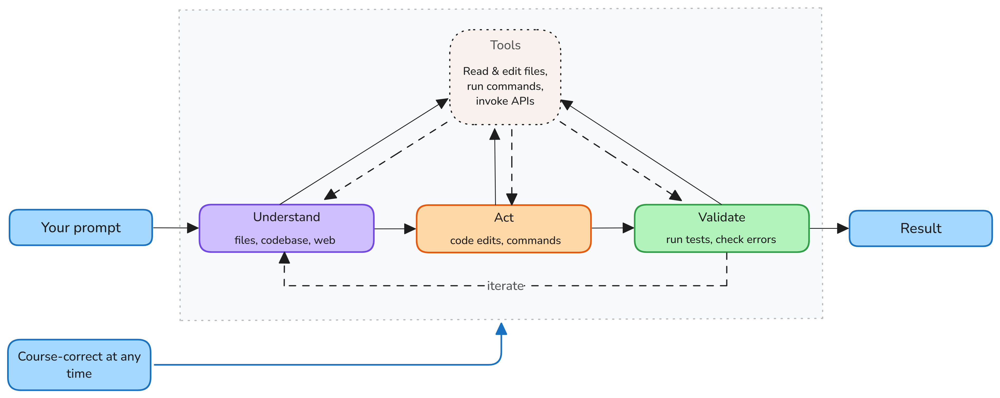
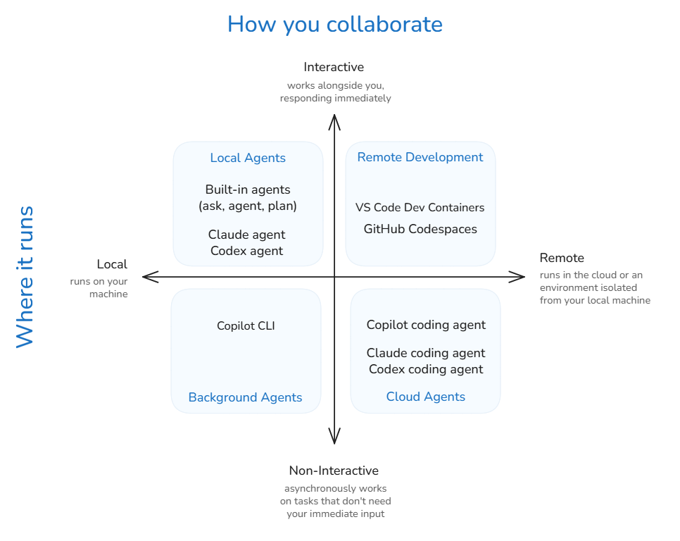
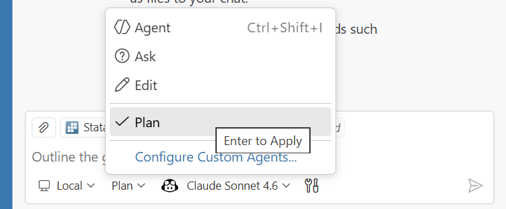

# Introduction

## Motivation {.small-slide}

In Day 1, we covered basics and concluded that using AI comes with the
practical limitataions such as:

::: incremental

1. **Context window size** — the amount of information you can provide to the AI
    at once is limited.

2. **Requests** — the number of interactions you can have with the AI in a
   are costly and we need to minimize them by optimizing the context and prompting.

3. **Hallucinations** — the AI may generate plausible-sounding but incorrect or
   irrelevant information, which can lead to errors if not carefully managed.
:::

## Agenda for today {.small-slide}

Today we will:

1. Explore **context engineering** with `#tools` and `MCP` connectors.
2. `agents` and `skills` for becoming a specialist.
3. Look into the **Planning mode**.
4. Customize your Positron's assistant with out-of-the-box `skills`.
5. Write a `/prompt` file to execute a routine task.
6. See where to learn further know-how to develop and use `skills`, `agents`, and more.

# Tools and MCP
## Tools vs MCP {.small-slide}

- **Tools** — IDE functions an agent calls during chat (search code, run commands, fetch web, invoke APIs).

- **MCP** — open standard connecting AI apps to external systems via separate servers exposing tools, resources, and prompts.

## Tools in Positron {.small-slide}

[Tools]{.alert} extend agents with specialised functionality: searching code, running commands, fetching web content, or invoking APIs.

::: columns
::: {.column width="50%"}

**Three types of tools:**

1. **Built-in tools** — `#codebase`, `#problems`, `#web`, `#search`, `#edit`
2. **MCP tools** — from installed MCP servers
3. **Extension tools** — contributed by VS Code / Positron extensions

Toggle tools per-request via the **Configure Tools** button in the chat input.

📖 [code.visualstudio.com/docs/copilot/agents/agent-tools](https://code.visualstudio.com/docs/copilot/agents/agent-tools)

:::
::: {.column width="50%"}

{fig-align="center" width="70%"}


{fig-align="center" width="50%"}

:::
:::


## Using Tools in Chat {.small-slide}

Reference tools explicitly in prompts with `#` followed by the tool name:

```text
"#executeCode in the file `analysis.do`."
"Research the #codebase to find how the variable `gdp_per_capita` is calculated."
"#read the file `methods.md` and summarize the methodology."
"#inspectVariable `population` to understand its distribution and missingness."
"#search for recent papers on poverty reduction in Sub-Saharan Africa using #web."
```

**Permission levels** control agent autonomy:

| Level | Behaviour |
|-------|-----------|
| Default Approvals | Confirmation dialog before tool runs |
| Bypass Approvals | Auto-approves all tool calls |
| Autopilot *(preview)* | Auto-approves + auto-responds; works until done |

::: {.callout-tip appearance="minimal"}
📖 [code.visualstudio.com/docs/copilot/agents/agent-tools](https://code.visualstudio.com/docs/copilot/agents/agent-tools)
:::

## Demo: Tools in action

1. Open Positron and a random stata do file.
2. Write a prompt that references a tool, e.g. `#codebase` or `#inspectVariable`.
3. Observe the tool being called and the response generated.

## What is MCP? {.small-slide}

[Model Context Protocol (MCP)](https://modelcontextprotocol.io/) is an **open standard** for connecting AI applications to external systems: a [USB-C port for AI]{.alert}.

::: columns
::: {.column width="60%"}
{ width="100%"}
:::

::: {.column width="40%"}

MCP servers expose specialized **Tools** (executable functions), **Resources** (contextual data), and **Prompts** (reusable templates) to the AI agent.

:::
:::

::: aside
📖 [modelcontextprotocol.io/docs/getting-started/intro](https://modelcontextprotocol.io/docs/getting-started/intro)
:::

## MCP (WB caviats)

::: columns
::: {.column width="50%"}
1. MCP are still in early stages of adoption and tooling ecosystem is evolving rapidly.
2. MCP are not allowed in the VS Code from the WB Software Center.
3. Thus, to use MCP servers, you need to have some coding skills to set them up.

:::
::: {.column width="50%"}
**MCP examples**

- [Stata for Positron](https://github.com/ntluong95/positron-stata) uses [stata-mcp](https://github.com/hanlulong/stata-mcp) server on the back end which could be configured to connect.

- [Data360 MCP](https://worldbank.github.io/data360-mcp/) — connects to World Bank Data360 platform.

- Online citation tools, code linters, and more are being developed by the community.
:::
:::

## MCP Servers in Positron {.small-slide}

1. Only by configurinf **`.vscode/mcp.json`** through **Command Palette** — `MCP: Add Server`.
2. WB Disables: **Extensions view** — search `@mcp` and install from the MCP server gallery

::: columns
::: {.column width="50%"}

`Ctrl+Shift+P` → `MCP: Open User Configuration` → add server config:

```json
{
	"servers": {
		"stata-mcp": {
			"type": "sse",
			"url": "http://localhost:4000/mcp"
		}
   }
}

```

:::
::: {.column width="50%"}

{fig-align="center" width="100%"}
:::
:::

::: aside
📖 [code.visualstudio.com/docs/copilot/customization/mcp-servers](https://code.visualstudio.com/docs/copilot/customization/mcp-servers)
:::

## MCP vs Tools {.tiny-slide}

| | [MCP]{.alert} | [Tools]{.fg} |
|---|---------|---------|
| **What** | Open protocol / standard | IDE-level concept |
| **Scope** | Server exposes **tools + resources + prompts** | Individual callable function |
| **Runs as** | Separate process (local or remote) | Within the agent loop |
| **Portable** | Works across any MCP-compatible host | Specific to VS Code / Positron |
| **Config** | `mcp.json` or extensions gallery | Built-in, extension, or MCP-sourced |
| **Selection** | Server is enabled/disabled as a whole | Toggled individually per request |

: {.sm .bordered}

::: {.callout-insight appearance="minimal"}
**MCP** is *how* you connect external capabilities. **Tools** are *what* the agent uses during a chat session. MCP servers *provide* tools (and more).
:::

## Demo: Stata MCP {.tiny-slide}

::: columns
::: {.column width="50%"}

1. No need to install any additional software, only [Stata for Positron `ntluong95/positron-stata`](https://github.com/ntluong95/positron-stata) that we installed on Day 1.

2. Configure MCP server connection as described in the previous slide.

3. Start MCP server locally by pressing `Start`

4. Use `#stata_run_file` or `#stata_run_selection` in the chat as a new tool.

5. Observe the difference in executing code via the MCP tool.

:::
::: {.column width="50%"}


**Customising the MCP connection:**

`Ctrl+Shift+P` → `MCP: Open User Configuration` → edit server config:

```json
{"servers": {"stata-mcp": {
"url": "http://localhost:4000/mcp-streamable"
}}}
```


{fig-align="center" width="100%"}
:::
:::


# Agents {.center}

## What is an Agent? {.tiny-slide}

An [agent]{.alert} is an AI system that autonomously **plans and executes** coding tasks. You give it a high-level goal — it breaks it into steps, executes them with tools, and self-corrects when it hits errors.

::: columns
::: {.column width="50%"}

**Default agents in Positron:**

| Agent | Purpose |
|-------|---------|
| **Ask** | Answers & code suggestions — no execution |
| **Edit** | Suggests code changes for you to apply |
| **Agent** | Autonomously runs code, edits files, calls tools |
| **Plan** | Creates a detailed plan before execution |

: {.sm .bordered}

:::
::: {.column width="50%"}

**What makes agents powerful:**

::: incremental
- 🔁 **Iterative** — loop until the task is done
- 🔧 **Tool-using** — read files, run commands, call APIs
- 🧠 **Self-correcting** — diagnose errors and retry
- 🎛️ **Customisable** — create custom `.agent.md` files with specific tools & instructions
:::

:::
:::

::: aside
📖 [positron.posit.co/assistant-chat-agents](https://positron.posit.co/assistant-chat-agents.html) · [code.visualstudio.com/docs/copilot/concepts/agents](https://code.visualstudio.com/docs/copilot/concepts/agents)
:::

## The Agent Loop {.small-slide}

Every agent follows the same iterative cycle — [Understand → Act → Validate]{.alert} — until the task is done.

::: columns
::: {.column width="55%"}

{width="100%"}

::: small
**You stay in control by**:

- Redirecting requests, adding context, or stopping at any time.
- Accepting or rejecting tool calls, and providing feedback.
:::
:::
::: {.column width="45%"}

**Three stages:**

1. **Understand** — reads files, searches the codebase, looks up docs
2. **Act** — edits code, runs commands, calls tools / MCP servers
3. **Validate** — runs tests, checks errors, self-corrects

At each step the model picks the next action. Tool outputs feed the next iteration.

:::
:::

::: aside
📖 [code.visualstudio.com/docs/copilot/concepts/agents](https://code.visualstudio.com/docs/copilot/concepts/agents#_planning)
:::


## Agent Types {.tiny-slide}

::: columns
::: {.column width="50%"}

Agents run in different environments depending on when you need results and how much oversight you want.

{fig-align="center" width="100%"}

:::
::: {.column width="50%" .small}

| Type | Where | Interaction |
|------|-------|-------------|
| [Local]{.alert} | Your machine | Interactive in IDE |
| [Background]{.fg} | Your machine | Autonomous, async |
| [Cloud]{.highlight} | GitHub infra | Autonomous, remote|

**Choosing the right type:**

- **Quick fix / refactor** → Local agent
- **Long build / migration** → Background agent
- **CI/CD, issue triage** → Cloud agent (GitHub Copilot coding agent)

:::
:::

::: aside
📖 [code.visualstudio.com/docs/copilot/agents/overview](https://code.visualstudio.com/docs/copilot/agents/overview)
:::


## Subagents {.small-slide}

For complex tasks, the main agent can [delegate subtasks]{.alert} to **subagents** — independent AI agents that work in their own context window and report back.

::: columns
::: {.column width="50%" .incremental}

**Why subagents?**

- [Context isolation]{.fg} — each subagent gets a **fresh context window**, preventing the main conversation from overflowing with intermediate results
- [Parallel execution]{.highlight} — multiple subagents can run simultaneously (e.g. analyse security, performance, and accessibility at once)

:::
::: {.column width="50%" .incremental}

- [Focused results]{.alert} — only the **summary** comes back to the main agent, reducing token usage

-  **Example: Plan agent**

::: fragment
::: {.callout-warning appearance="simple"}
**Subagent burn premium requests.**
:::
:::
:::

::: aside
📖 [code.visualstudio.com/docs/copilot/agents/subagents](https://code.visualstudio.com/docs/copilot/agents/subagents)
:::


## Agent Memory (new in VS Code / not available in Postron yet) {.tiny-slide}

::: columns
::: {.column width="60%" }

::: {.small}

Agents use [memory]{.alert} to retain context **across conversations** — no more repeating yourself.

- Agents read and write memory files automatically as they learn your patterns.

- Note: this is an emerging feature. It is not yet supported by Postron yet.

:::

**Three memory scopes:**

::: {.compact-table}
| Scope | Persists |
|-------|-------------------|
| **User** (`/memories/`) | Across workspaces |
| **Repository** (`/memories/repo/`) | Across conversations |
| **Session** (`/memories/session/`) | Current conversation |
:::

:::
::: {.column width="40%"}

**What memory captures:**

- 🎯 Your coding conventions and preferences
- 📁 Project structure and key files
- 🐛 Lessons from past debugging sessions
- 📐 Architectural decisions

::: {.callout-tip appearance="minimal"}
View memory: `Chat: Show Memory Files` in Command Palette. The Plan agent stores its plans at `/memories/session/plan.md`.
:::

:::
:::

::: aside
📖 [code.visualstudio.com/docs/copilot/agents/memory](https://code.visualstudio.com/docs/copilot/agents/memory)
:::


## Customising Agents (overview) {.tiny-slide}

::: {.compact-table .small}

| Mechanism | What it is | When it fires | Scope |
|-----------|---------------------|-------------------|-------|
| [**Instructions**](https://code.visualstudio.com/docs/copilot/customization/custom-instructions) (`.github/copilot-instructions.md`) | Global rules appended to every prompt | Every chat request | Workspace-wide |
| [**Prompt files**](https://code.visualstudio.com/docs/copilot/customization/prompt-files) (`.github/prompts/*.prompt.md`) | Reusable task templates invoked with `/` | On demand (`/myPrompt`) | Per-task |
| [**Custom agents**](https://code.visualstudio.com/docs/copilot/customization/custom-agents) (`.github/agents/*.agent.md`) | Persona + curated tool set | When user `@mentions` the agent | Per-conversation |
| [**Skills**](https://code.visualstudio.com/docs/copilot/customization/agent-skills) (`.github/skills/*/SKILL.md`) | Scoped expertise package loaded by description match | Auto-matched to request | Per-request |
| [**Hooks**](https://code.visualstudio.com/docs/copilot/customization/hooks) (`.vscode/hooks/*.md`) | Pre/post actions on agent events (save, create, command) | Automatically on event | Per-event |
| [**MCP plugins**](https://code.visualstudio.com/docs/copilot/customization/mcp-servers) (`mcp.json` servers) | External servers exposing tools, resources, prompts via MCP | When agent selects the tool | Per-tool-call |

:::

::: {.callout-insight appearance="minimal"}
**Instructions** = always on. **Prompt files** = user-triggered templates. **Agents** = switchable personas. **Skills** = auto-loaded expertise. **Hooks** = event-driven side effects. **Plugins** = external tool servers.
:::

::: aside
📖 [code.visualstudio.com/docs/copilot/customization/overview](https://code.visualstudio.com/docs/copilot/customization/overview)
:::

::: notes

The agent loop is not one-size-fits-all. Positron and VS Code Copilot offer several customisation mechanisms:

:::
## Prompt files and custom instructions {.small-slide}

Table the compares what prompt files and instrucitons are

## Agents and skills {.small-slide}

::: columns
::: {.column width="50%"}

**Custom agents**

```{markdown file-name="stata-anlyst.agent.md"}
---
description: Stata analyst
tools:
  - executeCode
  - read
  - search
---

You are a Stata specialist. Always follow
the DIME coding conventions...
```

Create via: `Chat: New Custom Agent…` in Command Palette (`Ctrl+Shift+P`).

:::
::: {.column width="50%"}

**Prompt files:**


:::
:::

::: aside
📖 [positron.posit.co/assistant-chat-agents](https://positron.posit.co/assistant-chat-agents.html) · [code.visualstudio.com/docs/copilot/customization/custom-agents](https://code.visualstudio.com/docs/copilot/customization/custom-agents)
:::


# Planning Mode: a useful agent {.center}

- Creates a step-by-step plan to accomplish your request.

- Retrieves relevant context and develops a detailed plan, which it presents for your review before proceeding with execution.

- see: [Positron Chat Agents](https://positron.posit.co/assistant-chat-agents.html) or [VSCode planning](https://code.visualstudio.com/docs/copilot/concepts/agents#_planning)

## Planning Mode {.tiny-slide}

For complex tasks, jumping straight into code generation leads to wrong architectural decisions. [Plan mode]{.alert} researches and designs **before** writing a single line of code.

::: columns
::: {.column width="50%" .small}

**4-phase workflow:**

::: {.incremental}
1. **Discovery** — read-only research using codebase analysis & tools
2. **Alignment** — clarifying questions to resolve ambiguities
3. **Design** — structured implementation plan drafted
4. **Refinement** — iterate on the plan with your feedback
:::

::: fragment
**How to activate:**

- Open Chat (`Ctrl+Alt+I`) → select **Plan** from the agents dropdown
- Or type `/plan` directly:

```text
/plan revising `analysis.do` to incorporate
new wave of the survey data.
```
:::

:::

::: {.column width="50%"}

::: fragment
{fig-align="center" width="90%"}

::: {.callout-tip appearance="minimal" .small}
# In VS Code (not yet in Positron)

The plan is saved to `/memories/session/plan.md` — view it with `Chat: Show Memory Files`.
:::

See: 📖 [VS Code / agents/planning](https://code.visualstudio.com/docs/copilot/agents/planning)

:::

:::

:::


## `/plan` analysis example

Try interacting with the agent in Plan mode with this prompt:

```text
/plan create an analysis of the survey data in data/ folder.
This analysis should produce poverty and inequality statistics
based on the individual data as well
```

Use [Self-study Example2](/selfstudy/example-2.qmd){target="_blank"} as a
starting point, and observe how the agent approaches the task differently
with the planning mode activated.

## Planning mode in action (2) {.small-slide}

::: columns
::: {.column width="50%"}

**Scenario:** refactor a Stata script to follow project conventions
using [Self-study: Example 3](/selfstudy/example-3.qmd){target="_blank"}

```text
/plan revising `analysis.do` to
incorporate new 2024 wave of the
survey data. Ask any clarifying
questions you have before drafting
the plan. Then, produce a step-by-
step plan for my review. If you
need to use any tools, explain
why they are needed and how they
will work before requesting my approval.
```

:::
::: {.column width="50%"}

**What the agent does:**

::: incremental
1. Reads `analysis.do`, `README.md`, and related files
2. Reasons and Asks
3. Drafts a step-by-step plan for your review
4. On approval → hands off to the default agent for execution
:::


:::
:::

::: {.fragment .callout-tip appearance="minimal"}
Use a **powerful reasoning model** (e.g. `claude-4.6-sonnet`, `claude-4.6-opus`)
for planning and a **faster model** for implementation.
:::


# Skills

## What is a Skill? {.small-slide}

A [Skill]{.alert} is a **scoped package of expertise** — a `SKILL.md` file with
focused instructions (and optional reference files) that the agent loads **only
when the request matches its description**.

::: columns
::: {.column width="55%"}

**Think of it as** a specialist colleague who walks into the meeting with the
right handbook — only when the topic actually calls for them.

::: incremental
- **Always indexed:** skill name + one-line description.
- **Loaded on match:** the `SKILL.md` body + any referenced files.
- **Composable:** several skills can fire on the same request.
- **Portable:** plain Markdown, version-controlled with the project.
:::

:::

::: {.column width="45%"}

::: {.phase-card .phase-day1}
#### 1. TRIGGER
Request matches the skill's `description`.
:::

::: {.phase-card .phase-selfstudy}
#### 2. LOAD
Agent reads `SKILL.md` and pulls any referenced files.
:::

::: {.phase-card .phase-day2}
#### 3. APPLY
Agent follows the skill's rules and workflow for the rest of the task.
:::

:::
:::

::: aside
📖 [anthropic.com/news/skills](https://www.anthropic.com/news/skills) · keeps the context window small via *progressive disclosure*
:::

## Anatomy of a Skill {.tiny-slide}

A skill is a folder with `SKILL.md` at its root. The YAML frontmatter is the
[trigger contract]{.alert} — write the `description` for the *model* to match
on, listing the phrases and situations it should fire on.

::: columns
::: {.column width="55%"}

```yaml
---
name: dime-stata-style
description: >
  Align Stata code (.do files, code blocks in
  .qmd/.Rmd) to the DIME Analytics Stata Style
  Guide. Use whenever the user asks to write,
  review, refactor, or lint Stata code, or to
  "apply DIME best practices". Always consult
  before writing Stata in this project.
metadata:
  version: "1.0"
  source: https://worldbank.github.io/dime-data-handbook/
---

# DIME Stata Style Skill
...core rules · decision tree · workflows...
```

:::

::: {.column width="45%"}

```text
.github/skills/dime-stata-style/
├── SKILL.md             ← always indexed
└── references/
    ├── style-guide.md   ← loaded on demand
    ├── review-checklist.md
    └── abbreviations.md
```

::: {.callout-insight appearance="minimal"}
The agent reads only what it needs: `SKILL.md` first, then drills into
`references/` for rule-level detail.
:::

:::
:::

::: aside
📖 See [.github/skills/](../../.github/skills/) in this repo for the full files.
:::

## Skills shipped with this course {.small-slide}

Three skills live in [`.github/skills/`](../../.github/skills/) — each solves
one narrow problem well, rather than one giant "do everything" prompt.

::: columns
::: {.column width="33%"}
::: {.obj-card .card-understand}
#### dime-stata-style
- Enforces the DIME Analytics Stata Style Guide
- Covers boilerplate, paths, naming, spacing, loops, missing values
- Three reference files for deep rules
:::
:::
::: {.column width="33%"}
::: {.obj-card .card-apply}
#### proofread
- Mechanical typo, grammar, punctuation, casing fixes on `.qmd` / `.md`
- US English; preserves YAML, code, and Pandoc markup
- Flags ambiguous fixes rather than guessing
:::
:::
::: {.column width="33%"}
::: {.obj-card .card-control}
#### brand-yml
- Creates and edits `_brand.yml` for Quarto and Shiny
- Colors, fonts, logos, identity — from one source of truth
- Loads only on theming / branding requests
:::
:::
:::

::: {.callout-tip appearance="minimal"}
**Try it:** ask the agent to *"clean up the Stata snippet in `methods/example.do`"* —
the `dime-stata-style` skill loads automatically on the word "Stata".
:::

::: aside
📖 [anthropic.com/news/skills](https://www.anthropic.com/news/skills) — Anthropic's "Agent Skills" announcement (Oct 2025)
:::


# Practice:

In this practice, we will use Example 3 to revise code and include new data
for 2024 using the planning mode. We will also use tools and MCP features to
optimize the process. Finally to give our agent some additional knowledge,
we will use skills that are relevant for this task.

## Planning to revise code in example 3 {.small-slide}
