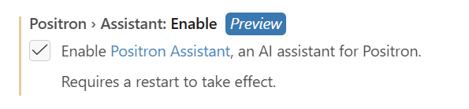
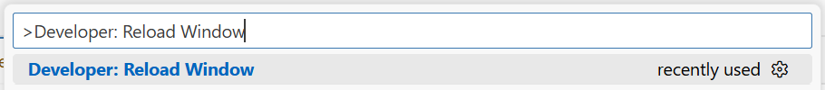

**What you need to do:**

- Sign in to GitHub inside Positron
- Enable the Positron Assistant in settings
- Select your preferred AI model (GitHub Copilot, Claude, GPT, etc.)

::: callout-important
**Prerequisite: GitHub Copilot must be activated before completing these steps.**
Complete [GitHub setup](github.qmd) (account + Copilot access) and install [Positron extensions](extensions.qmd) first.
:::

---

## Step 1: Connect GitHub to Positron

GitHub Copilot requires your GitHub account to be linked to Positron.

| # | Action |
|---|--------|
| 1 | Open the **Account** menu (bottom-left of Positron) |
| 2 | Click **Sign in to your GitHub account** |
| 3 | Authorise GitHub in your browser |
| 4 | Confirm the authorisation request |
| 5 | Complete authentication and grant permissions |

See the [Positron Assistant Guide](https://positron.posit.co/assistant.html) for more details.

::: callout-warning
Reload Positron after installing extensions or signing in: `Ctrl+Shift+P` → `Developer: Reload Window`.
:::

---

## Step 2: Enable Positron Assistant

Open Positron settings (`Ctrl+,`) and search for `positron.assistant.enable`. Check the box to enable it.



Reload Positron to apply changes.



See [Enable Positron Assistant](https://positron.posit.co/assistant-getting-started.html#step-1-enable-positron-assistant) in the official docs.

---

## Step 3: Configure the AI Model

By default Positron Assistant uses **GitHub Copilot** when you are signed in. You can switch to other models (Anthropic Claude, OpenAI GPT-4.5, etc.) from the model selector in the chat panel.

::: callout-note
Code completion is always provided by the GitHub Copilot extension. Anthropic Claude and other LLMs are available only in the chat/agent interface.
:::

Follow [Configure language model providers](https://positron.posit.co/assistant-getting-started.html#step-3-use-positron-assistant) to change the default.

---

## Step 4: Use Positron Assistant

Open the assistant: `Ctrl+Shift+P` → `Help: Ask Positron Assistant`.

Example prompt to test:

```
Write a Stata do-file that loads the auto dataset and summarizes the price variable.
Open it and explain how to run it.
```

See [Use Positron Assistant](https://positron.posit.co/assistant-getting-started.html#step-3-use-positron-assistant) for the full guide.

---

## Troubleshooting

- **Copilot not working after install**: confirm GitHub is signed in, Positron Assistant is enabled, then reload the window.
- **No AI suggestions in code**: check that the GitHub Copilot extension is installed and enabled in the Extensions panel (`Ctrl+Shift+X`).
- **Stata MCP runs code from OneDrive**: move your project to a path without spaces, e.g. `C:\Users\wbXXXXXXX\code`. See the [known issue](https://github.com/hanlulong/stata-mcp/issues/52) for updates.

---

## Support

- IT Help: [ITHelp@worldbankgroup.org](mailto:ITHelp@worldbankgroup.org) | [Walk-in centres](https://worldbankgroup.sharepoint.com/sites/itsupport/SitePages/PublishingPages/Walk-in-Centers-in-Washington-DC--05042021-1608401_new.aspx)
- GitHub / Copilot access: [github@worldbank.org](mailto:github@worldbank.org)
- Additional resources: [Positron docs](https://positron.posit.co/) · [GitHub Copilot docs](https://docs.github.com/en/copilot)
