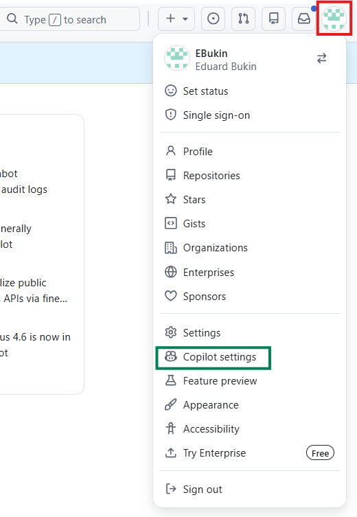
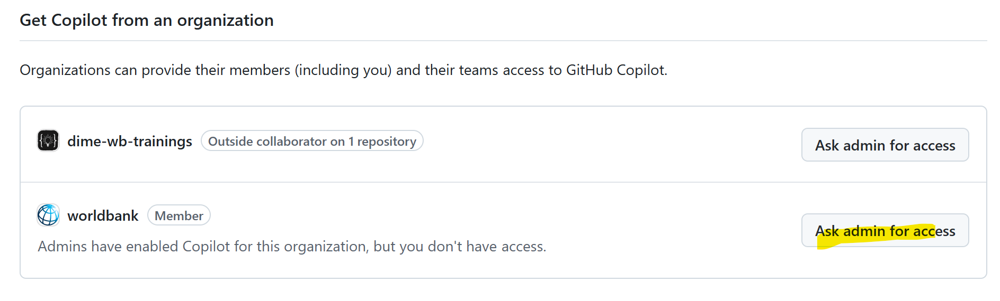
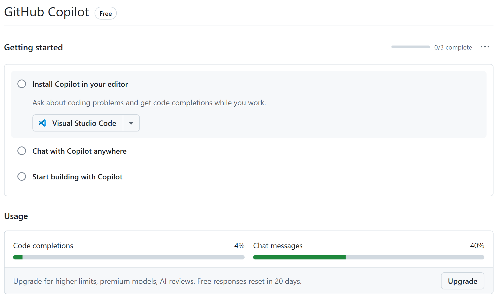
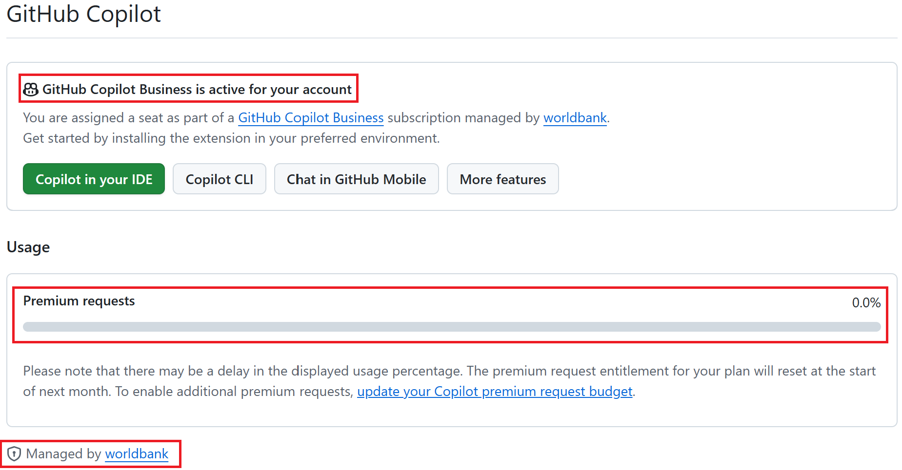

**What you need to do:**

- [Create a GitHub account](https://github.com/signup) using your [**personal email address**]{style="background-color: #c0392b; color: white; padding: 2px 4px;"} (not the WB email)

- Join the [github.com/worldbank](https://github.com/worldbank) (World Bank GitHub organization) [via eServices](https://worldbankgroup.service-now.com/wbg/en/join-github-organization-account-request?id=wbg_sc_catalog&sys_id=910e1739db1a54903c5960ab13961912&table=sc_cat_item&searchTerm=github)

  - See [WB GitHub Enterprise Overview](https://github.com/worldbank/ospo/tree/main?tab=readme-ov-file#octocat-github-enterprise)

- Request GitHub Copilot access from the WB organization or subscribe privately.

  - See: [WB GitHub Copilot](https://github.com/worldbank/ospo/tree/main?tab=readme-ov-file#-github-copilot)

- **Enable [Premium Request Chargeback Process](https://github.com/worldbank/ospo/blob/main/docs/copilot/premium-request-chargeback.md)**

  - Using Copilot bears cost. WB copilot access allows 300 free requests per month to advanced LLMs (GPT-4.5, Claude). Any overuse beyond the free requests incurs a cost that are blocked by default.

- With any questions related to WB Github reach out to [github@worldbank.org](mailto:github@worldbank.org).

## Access Levels

Different setup steps unlock different capabilities:

| Setup | Repositories | GitHub Copilot | WB Org Repos |
|-------|-------------|----------------|--------------|
| No GitHub account | Public only | ❌ | ❌ |
| Personal account | Personal repos | ⚠️ Limited, no Claude | ❌ |
| + Copilot Pro/Pro+ subscription | Personal repos | ✅ Full (500/1500 req/mo), Claude | ❌ |
| + WB Org member | Personal + WB repos | ⚠️ Basic only (No premium request) | ✅ |
| + WB Org + WB Copilot access | Personal + WB repos | ✅ Full (300 req/mo), Claude/GPT. Overuse budget | ✅ |

::: callout-tip
For AI-assisted coding you need at minimum a personal GitHub account with Copilot access (private subscription **or** WB Copilot access).
:::

## Create a GitHub Account

Create an account at <https://github.com/signup>. Use your [**personal email address**]{style="background-color: #c0392b; color: white; padding: 2px 4px;"}, not your World Bank email.

## Join [github.com/worldbank](https://github.com/worldbank)

1. Submit a [Join GitHub Organization Account Request](https://worldbankgroup.service-now.com/wbg/en/join-github-organization-account-request?id=wbg_sc_catalog&sys_id=910e1739db1a54903c5960ab13961912&table=sc_cat_item&searchTerm=github) on eServices to join [github.com/worldbank](https://github.com/worldbank)

2. Accept the invitation email sent to your GitHub account email

3. Confirm membership by following the steps in the email
   - If you don't accept the invitation within 7 days it expires — resubmit through eServices.

4. See [WB GitHub Enterprise Overview](https://github.com/worldbank/ospo/tree/main?tab=readme-ov-file#octocat-github-enterprise)

::: callout-warning
**Inactivity policy.** Members who have not contributed to any WB GitHub repository for several months may be removed from the organisation automatically. If you lose access, resubmit the eServices request to rejoin. This does **not** affect your personal GitHub account or Copilot subscription.
:::

## Access GitHub Copilot

You can either use Github Copilot **from the WB Organization** or **subscribe privately**.

To access GitHub Copilot through the WB organization, you need to request access after joining the WB org. Go to [GitHub → Settings → Copilot](https://github.com/settings/copilot).

::: {.panel-tabset}

## Copilot settings

## Request access

Scroll down to **"Get Copilot from an organization"** and click **Request access** from the worldbank organization.

## Email WB GitHub team

Then send an email to [github@worldbank.org](mailto:github@worldbank.org) with:

- Subject: `Request GitHub Copilot Access`
- Body: your GitHub username + brief reason
- Copy your manager for approval

:::

::: callout-info

### GitHub Copilot with a private subscription

If you have a personal Copilot subscription, you can use it with your GitHub account regardless of WB org membership. See [GitHub Copilot Plans for individuals](https://github.com/features/copilot/plans)

Once you are granted access to Copilot through the WB org, your private subscription will be terminated and you will be refunded unused budget. You cannot easily switch to private subscription after joining the WB org.
:::

## Verify GitHub Copilot

Go to [GitHub → Settings → Copilot](https://github.com/settings/copilot) and check your usage statistics.

::: {.panel-tabset}

### **No access:**

### **Access granted:**

:::

## Enable Premium Request Overuse

The WB plan includes 300 premium requests/month. This is sufficient but limited.
If you find yourself hitting the limit, you can request an overuse budget to increase your monthly limit.

To enable budget for overuse **enable [Premium Request Chargeback Process](https://github.com/worldbank/ospo/blob/main/docs/copilot/premium-request-chargeback.md)**:

1. Get manager approval and a budget code.
2. Set a monthly spending limit.
3. Email [github@worldbank.org](mailto:github@worldbank.org) with your budget code (cc your manager)
