> **Why?** This software stack powers the AI-assisted coding workflow used
> throughout the course.

**What you need to do:**

1. Install seven tools: Stata, R, Python + `uv`, Positron, Quarto, and Git
2. Verify each tool works correctly (see [Verification](#verification))
3. Troubleshoot any issues (see [Common Problems](common-problems.qmd))

## Software Installation

::: {.panel-tabset}

### WB Laptop

1. Restart your computer to ensure pending updates are applied.
2. Open **Software Center** and install the items in @tbl-software in order.
3. If any program does not appear in the Software Center, submit a
   [Software Installation Request](https://worldbankgroup.service-now.com/wbg/en/software-installation-request?id=wbg_sc_catalog&sys_id=bd1e71b86f16d340db112d232e3ee4b7&table=sc_cat_item&searchTerm=Software%20installation)
   or contact [ITHelp@worldbankgroup.org](mailto:ITHelp@worldbankgroup.org).

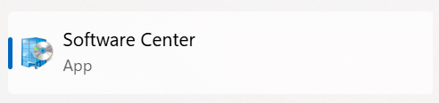

### Private Laptop

Download and install each tool from the links in @tbl-software.

:::


| Software | WB Laptop (Software Center) | Private Laptop |
|:-----------------:|:--------------------------------:|-------------------|
| Stata (19+ MP) | 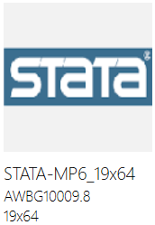{width="50"} |  |
| Positron (latest) | 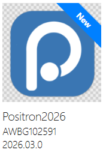{width="50"} | [positron.posit.co](https://positron.posit.co/download.html) |
| Quarto (1.9+) | 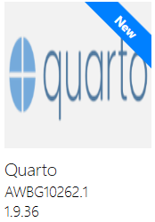{width="50"} | [quarto.org](https://quarto.org/docs/get-started/) |
| R (4.5.3+) | 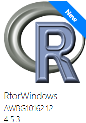{width="50"} | [cran.r-project.org](https://cran.r-project.org/) |
| Python (3.13+) | 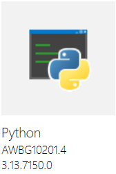{width="50"} | [python.org](https://www.python.org/downloads/) |
| `uv` Python package manager | See below. |  See below. |
| Git (2.52+) | 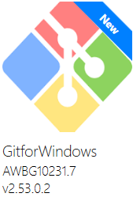{width="50"} | [git-scm.com](https://git-scm.com/download/win) |

: Software {#tbl-software}


**Install `uv` (Python package manager)**

1. Open PowerShell (press `Windows` key, type `PowerShell`, and open it).
2. Run:

``` ps
pip install uv
uv --version
```

You should see a version number printed. If not, see [Common Problems](common-problems.qmd).

::: {.callout-info collapse="true"}
### GIF guide for `uv` installation

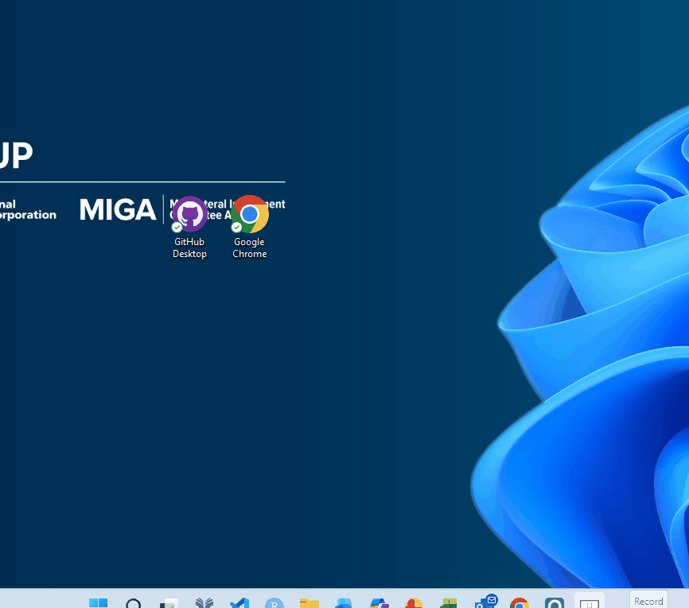{width="650"}
:::

::::::: columns
:::: {.column width="50%"}
::: callout-note
**If any software was previously installed from the Software Center:**

Press "**Install**" and each eligible package will update to the latest
version.
:::
::::

:::: {.column width="50%"}
::: callout-warning
**If any software was previously installed manually (by using an admin
password):**

Contact [ITHelp\@worldbankgroup.org](mailto:ITHelp@worldbankgroup.org)
to remove it first.
:::
::::
:::::::


## Verification

::: {.panel-tabset}

## Positron

Open **Positron** — if it launches, it's working. See [Positron Overview](https://positron.posit.co/layout.html#basic-overview) for a tour of the layout.

{width="650"}

## R

In Positron, open the **Console** (`Ctrl+Shift+P` → "Console: Focus on Console"). You should see an R prompt.

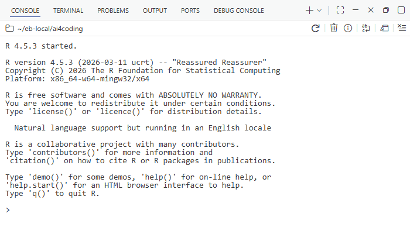{width="650"}

## Python

In Positron, open the **Terminal** (`` Ctrl+Shift+` ``) and run:

``` ps
python --version
pip list
```

You should see the Python version and a list of installed packages.

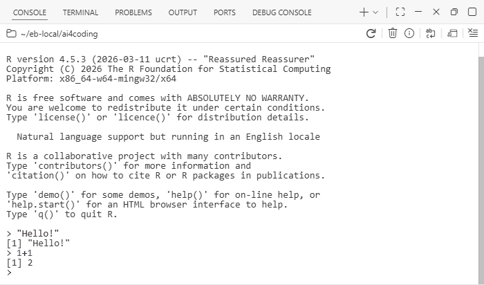{width="650"}

## `uv`

In the Terminal, run:

``` ps
uv --version
```

You should see a version number.

{width="650"}

## Quarto

In the Terminal, run:

``` ps
quarto --version
quarto check
```

You should see a version number and a passing check.

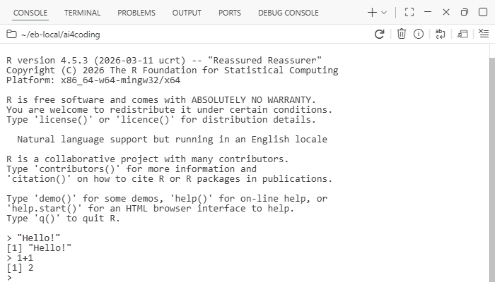{width="650"}

:::
