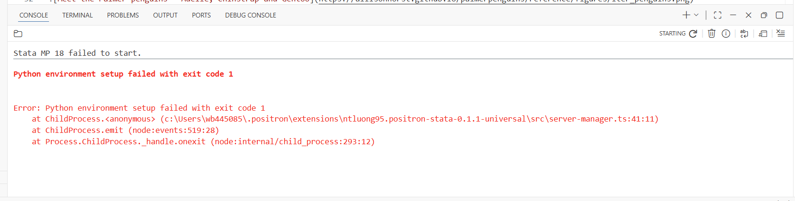
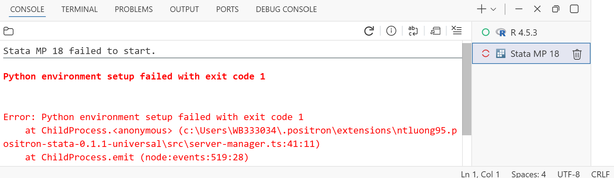
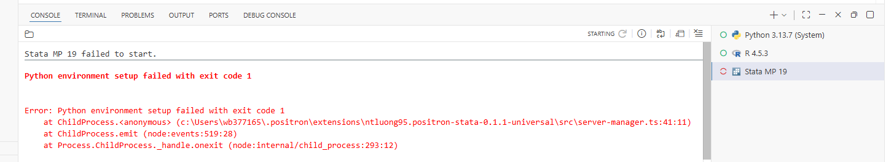
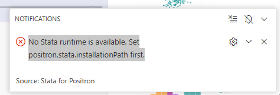

# Positron-Stata integration

Author

Affiliation

[Eduard Bukin](https://github.com/ebukin) [](mailto:ebukin@worldbank.org) [![](data:image/png;base64,iVBORw0KGgoAAAANSUhEUgAAABAAAAAQCAYAAAAf8/9hAAAAGXRFWHRTb2Z0d2FyZQBBZG9iZSBJbWFnZVJlYWR5ccllPAAAA2ZpVFh0WE1MOmNvbS5hZG9iZS54bXAAAAAAADw/eHBhY2tldCBiZWdpbj0i77u/IiBpZD0iVzVNME1wQ2VoaUh6cmVTek5UY3prYzlkIj8+IDx4OnhtcG1ldGEgeG1sbnM6eD0iYWRvYmU6bnM6bWV0YS8iIHg6eG1wdGs9IkFkb2JlIFhNUCBDb3JlIDUuMC1jMDYwIDYxLjEzNDc3NywgMjAxMC8wMi8xMi0xNzozMjowMCAgICAgICAgIj4gPHJkZjpSREYgeG1sbnM6cmRmPSJodHRwOi8vd3d3LnczLm9yZy8xOTk5LzAyLzIyLXJkZi1zeW50YXgtbnMjIj4gPHJkZjpEZXNjcmlwdGlvbiByZGY6YWJvdXQ9IiIgeG1sbnM6eG1wTU09Imh0dHA6Ly9ucy5hZG9iZS5jb20veGFwLzEuMC9tbS8iIHhtbG5zOnN0UmVmPSJodHRwOi8vbnMuYWRvYmUuY29tL3hhcC8xLjAvc1R5cGUvUmVzb3VyY2VSZWYjIiB4bWxuczp4bXA9Imh0dHA6Ly9ucy5hZG9iZS5jb20veGFwLzEuMC8iIHhtcE1NOk9yaWdpbmFsRG9jdW1lbnRJRD0ieG1wLmRpZDo1N0NEMjA4MDI1MjA2ODExOTk0QzkzNTEzRjZEQTg1NyIgeG1wTU06RG9jdW1lbnRJRD0ieG1wLmRpZDozM0NDOEJGNEZGNTcxMUUxODdBOEVCODg2RjdCQ0QwOSIgeG1wTU06SW5zdGFuY2VJRD0ieG1wLmlpZDozM0NDOEJGM0ZGNTcxMUUxODdBOEVCODg2RjdCQ0QwOSIgeG1wOkNyZWF0b3JUb29sPSJBZG9iZSBQaG90b3Nob3AgQ1M1IE1hY2ludG9zaCI+IDx4bXBNTTpEZXJpdmVkRnJvbSBzdFJlZjppbnN0YW5jZUlEPSJ4bXAuaWlkOkZDN0YxMTc0MDcyMDY4MTE5NUZFRDc5MUM2MUUwNEREIiBzdFJlZjpkb2N1bWVudElEPSJ4bXAuZGlkOjU3Q0QyMDgwMjUyMDY4MTE5OTRDOTM1MTNGNkRBODU3Ii8+IDwvcmRmOkRlc2NyaXB0aW9uPiA8L3JkZjpSREY+IDwveDp4bXBtZXRhPiA8P3hwYWNrZXQgZW5kPSJyIj8+84NovQAAAR1JREFUeNpiZEADy85ZJgCpeCB2QJM6AMQLo4yOL0AWZETSqACk1gOxAQN+cAGIA4EGPQBxmJA0nwdpjjQ8xqArmczw5tMHXAaALDgP1QMxAGqzAAPxQACqh4ER6uf5MBlkm0X4EGayMfMw/Pr7Bd2gRBZogMFBrv01hisv5jLsv9nLAPIOMnjy8RDDyYctyAbFM2EJbRQw+aAWw/LzVgx7b+cwCHKqMhjJFCBLOzAR6+lXX84xnHjYyqAo5IUizkRCwIENQQckGSDGY4TVgAPEaraQr2a4/24bSuoExcJCfAEJihXkWDj3ZAKy9EJGaEo8T0QSxkjSwORsCAuDQCD+QILmD1A9kECEZgxDaEZhICIzGcIyEyOl2RkgwAAhkmC+eAm0TAAAAABJRU5ErkJggg==)](https://orcid.org/0000-0002-1003-1260)

Distributional Impact of Policies. Fiscal Policy and Growth Department

> **WARNING:**
>
> To be able to run Stata code in Positron, you need to install a Positron extension that connects the editor to Stata. The recommended extension is [Positron Stata](https://open-vsx.org/vscode/item?itemName=ntluong95.positron-stata), which provides native integration with console, data viewer, and plots.

Stata has no built-in editor integration. Extensions bridge the gap by connecting Positron to Stata’s backend, enabling an AI-assisted coding workflow. Three components work together:

1.  **Stata 18+** with Model Context Protocol (MCP) support executes Stata code.
2.  **Python + `uv`** — sends code to Stata and captures output.
3.  **A Positron extension** — surfaces results in the editor UI.

------------------------------------------------------------------------

## Step 1. Install the Stata for Positron

Native Positron integration of Stata with console, data viewer, plots, help, and documentation are on GitHub along with issue reporting: [github.com/ntluong95/positron-stata](https://github.com/ntluong95/positron-stata).

To install it:

1.  Open the Extensions panel (`Ctrl+Shift+X`)

2.  Search for **Stat for Positron** or `ntluong95.positron-stata`

3.  Click **Install** -\> **Trust and Install**

4.  Reload Positron: `Ctrl+Shift+P` → `Developer: Reload Window`

------------------------------------------------------------------------

## Step 2. Configure the extension

1.  Open settings in Positron (`Ctrl+,`).

2.  Search for [`positron.stata.installationPath`](vscode-server://settings/positron.stata.installationPath)

    Note setting name is “**Positron \> Stata**: Installation Path”. Check this is correct! Especially if you have or had multiple stata extensions installed in positron.

3.  Set the path to your Stata installation, e.g. `C:\Program Files\StataNow19\` It also works with Stata 18.

------------------------------------------------------------------------

## Step 3. Verify Stata runs in Positron

1 Create a new `.do` file and run example code to verify the extension is working (or open an existing one).

- create `test.do` with:

  ``` numberSource
  sysuse auto
  summarize price
  display "Stata is working!"
  ```

- Save the file (`Ctrl+S`) — **unsaved edits are not executed**.

- Run the file (`Ctrl+Shift+D` or `Ctrl+Shift+P` → `Stata: Run Current File`)

## Installation

[](..\assets/img/pos-stat-p1.gif)

## Verification

[](..\assets/img/pos-stat-p2.gif)

## Key features

- Create and run `.do` files
- AI agent integration
- Console: execute Stata code and see output
- Environment: variables and globals
- Data: view, and explore
- Figures: display, manage, and export
- Have multiple Stata sessions

[](..\assets/img/pos-stata-ext1.gif)

------------------------------------------------------------------------

## Step 4. Stata-MCP feature (optional)

The extension also supports Model Context Protocol (MCP) for AI agent use. MCP allows AI agents to have full context of your Stata environment, including variables, data, and figures bypassing the console and enabling more powerful AI-assisted coding without distracting the user.

**This reduce control as allows stata to run code without user explicitly** **accepting to run it. Use with caution!**

In positron:

1.  `Ctrl+Shift+P` → `MCP: Open User Configuration`

2.  Paste in there:

    ``` numberSource
    {
     "servers": {
         "stata-mcp": {
             "type": "sse",
             "url": "http://localhost:4000/mcp"
         }
    }
    }
    ```

3.  Save the file

4.  `Ctrl+Shift+P` → `MCP: List Servers` → `stata-mcp` → `Start Server`

------------------------------------------------------------------------

## Step 5. Troubleshooting

### Stata console does not start

## Error 1

[](images/stata-error-1.png)

## Error 2

[](images/stata-error-2.png)

## Error 3

[](images/stata-error-3.png)

This error can have multiple causes. Common fixes include:

1.  UV is not properly installed. Check [Step 3: `uv` (Python package manager)](../prerequisites/software.llms.md#uv-install)

2.  Python cannot set environment using `uv`. Sometimes even when `uv` is installed, the extension cannot use it to set up the Python environment because of the software security settings on the laptops.

    to bypass it you may try manually installing python packages using `pip install` and once those are installed, it may start working.

    Required packages are in [requirements.txt](https://github.com/ntluong95/positron-stata/blob/main/python/requirements.txt). They include:

        fastapi==0.119.1
        uvicorn==0.38.0
        fastapi-mcp==0.4.0
        mcp==1.18.0
        pydantic==2.11.1
        pandas==2.3.3
        httpx==0.28.1

    You can install them in the global python environment by:

    - Keyboard `Windows` \> `PowerShell`

    - Paste in the power shell replacing `wbXXXXXX` with your WB username. check if `requirements.txt` exists in the folder specified before running the command.

      ``` numberSource
      pip install -r "c:\Users\wbXXXXXX\.positron\extensions\ntluong95.positron-stata-0.1.1-universal\python\requirements.txt"
      ```

3.  Restart Positron and try running Stata again.

### No stata runtime is available

[](images/stata-error-10.png)

This means that:

1.  You did not set the Stata installation path, see [Configure the extension](#sec-configure-extension)

2.  You set the path, but it is wrong. Check the path is correct and points to your Stata installation directory, e.g. `C:\Program Files\StataNow19\`.

3.  You set a correct path but to the wrong setting. Multiple extensions may require to set a Stata path. Make sure you set the path for the setting names [`positron.stata.installationPath`](vscode-server://settings/positron.stata.installationPath) and not another one (e.g. from a different Stata extension).

------------------------------------------------------------------------

## Step 5. Limitations

**Custom logs not supported** — `log using <filename>` conflicts with the extension’s own logging. Stata only allows one log at a time. Use `capture log using <filename>` to bypass this limitation.

\*\*Closing logs \_all with capture breaks the code\*\*. do not use `cap log close _all` because this will also close the logs used by the extension to capture Stata output, which will break the extension’s functionality. Instead, close logs individually with `cap log close <filename>`.

- **Bugs are possible** — report [issues to the extension developers](https://github.com/ntluong95/positron-stata/issues)

------------------------------------------------------------------------

## Alternative stata extension: Stata MCP

[Stata MCP](https://open-vsx.org/extension/DeepEcon/stata-mcp) is an alternative extension that integrates stata into the Positron. It is designed for VS Code / Cursor users, but underperforms in Positron, and does not have native Positron integration (e.g. no data viewer or plots in Positron). Installation is similar to Positron Stata above.

**Key differences:**

| Feature | Positron Stata | Stata MCP |
|----|----|----|
| Console output in Positron | ✅ | ✅ |
| Data viewer | ✅ | ❌ |
| Multiple Stata sessions | ✅ | ❌ |
| AI agent integration | ✅ | ✅ |
| MCP support | ✅ | ✅ |
| Maturity | New (2026) | More mature (2023) |
| Good for… | Positron users who want native integration | VS Code / Cursor users who want MCP support |

------------------------------------------------------------------------

## Extensions in Positron

Positron/VS Code ships with minimal built-in functionality by design — extensions add support for specific languages, tools, and workflows without bloating the core editor.

Notable extensions for this course:

- [stataglow](https://open-vsx.org/vscode/item?itemName=randrescastaneda.stataglow) extension for Stata syntax highlighting.

- [Positron Assistant](https://open-vsx.org/vscode/item?itemName=posit.assistant) — installed by default; provides AI code suggestions and completions via GitHub Copilot and other AI providers.

- [Claude Code](https://open-vsx.org/vscode/item?itemName=Anthropic.claude-code) — agentic AI coding using Anthropic’s Claude models.

- [Positron Databot](https://open-vsx.org/vscode/item?itemName=posit.databot) — AI-assisted data analysis and visualization.

- [VScode-pdf (tomoki1207.pdf)](https://open-vsx.org/vscode/item?itemName=tomoki1207.pdf) — view PDF files directly in Positron (e.g. for documentation).

- [Excel Viewer (GrapeCity.gc-excelviewer)](https://open-vsx.org/vscode/item?itemName=GrapeCity.gc-excelviewer) — view Excel files directly in Positron.

**Installing any extensions**

Open the **Extensions panel** with `Ctrl+Shift+X` or click the square icon  on the left sidebar.

To install any extension:

1.  **Search** for it by name and hit Enter, e.g. `positron assistant` or `claude code`. Note that if in the search bar there is a tag starting with “@”, remove it.

2.  Click **Install**

3.  If prompted “Do you trust the publisher?”, click **Trust and Install**

4.  If needed, **reload Positron**: `Ctrl+Shift+P` → `Developer: Reload Window`

[](..\assets/img/extensions-panel.png "Extensions panel")

Extensions panel

An alternative is the [Stata MCP](https://open-vsx.org/vscode/item?itemName=DeepEcon.stata-mcp) extension, which supports Model Context Protocol (MCP) for AI agent use.
