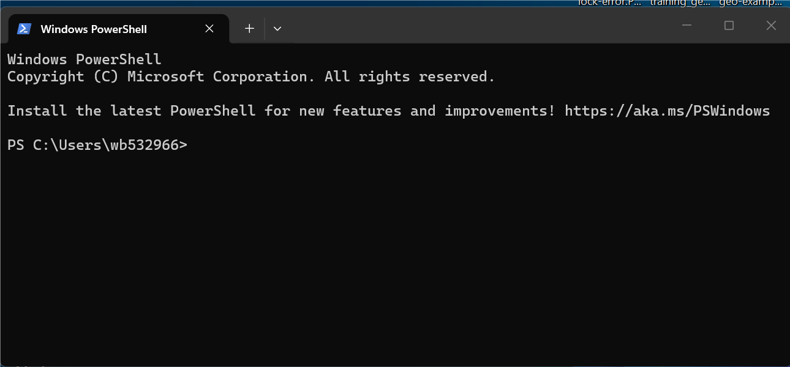
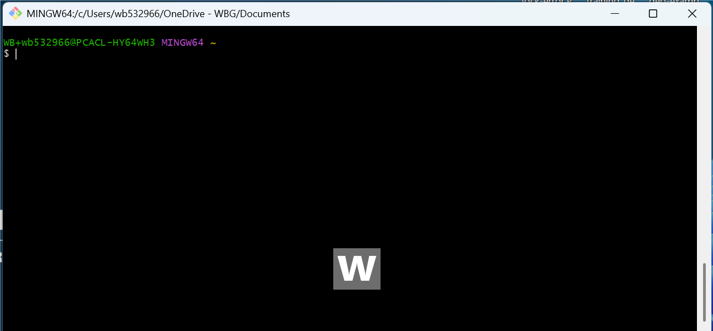
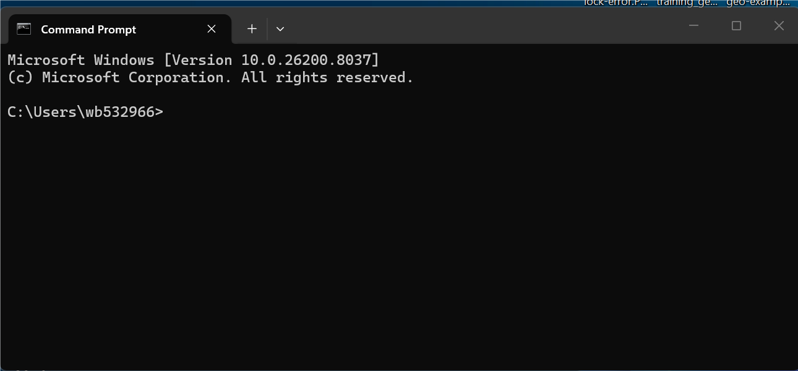
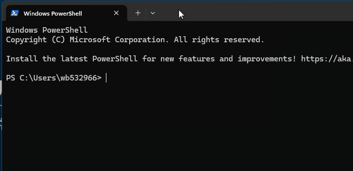
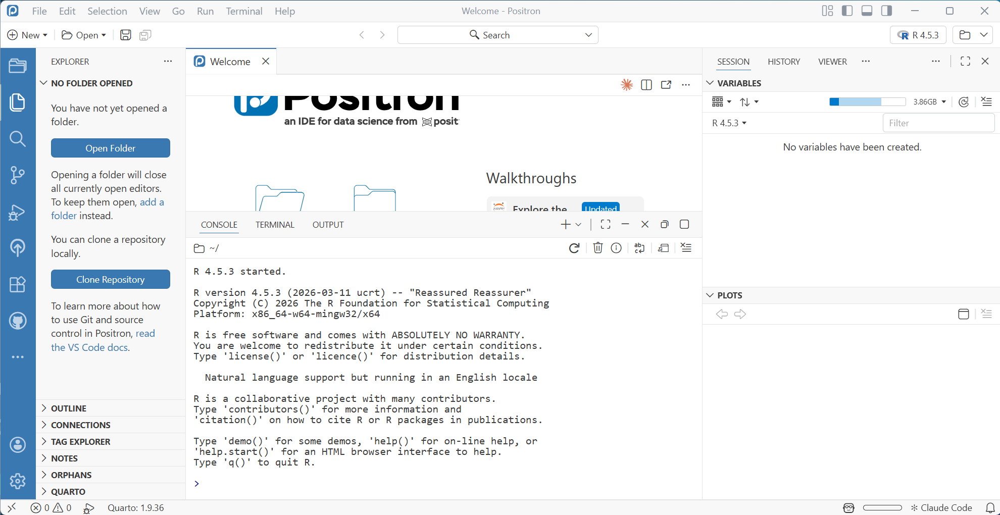
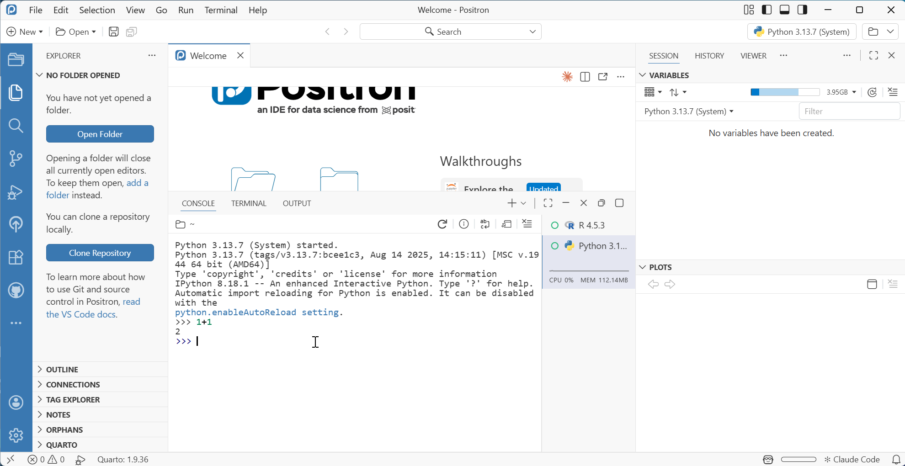
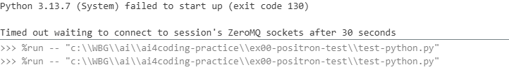

::: {.callout-warning appearance="simple"}
**Minimum requirements for this course**

1.  **Stata 19+ MP** installed and licensed
2.  **Positron** (latest version)
3.  **R** (4.5.3+)
4.  **Python** (3.13+)
5.  **`uv`** environment manager for Python
6.  **Quarto** (1.9+)
7.  **Git** (2.52+)


Note: This software stack powers the AI-assisted coding workflow used throughout the course and beyond.
:::

------------------------------------------------------------------------

## Step 1: Install software from the Software Center {#software-install}

::: {.panel-tabset}
## WB Laptop

1. Restart your computer to ensure pending updates are applied.
2. Open **Software Center** and install the items in @tbl-software in order.
3. If any program does not appear in the Software Center, submit a
   [Software Installation Request](https://worldbankgroup.service-now.com/wbg/en/software-installation-request?id=wbg_sc_catalog&sys_id=bd1e71b86f16d340db112d232e3ee4b7&table=sc_cat_item&searchTerm=Software%20installation)
   or contact [ITHelp@worldbankgroup.org](mailto:ITHelp@worldbankgroup.org).

::: {.callout-important appearance="simple"}

- If you have previously installed any of the software manually (or using an admin
  password), contact [ITHelp\@worldbankgroup.org](mailto:ITHelp@worldbankgroup.org)
  to remove it first, then install from the Software Center.

- If you have Python already installed for some times, **install new python**
  **from the software center** (AWBG10201.4) because it has broader permissions.
  Then set the Python path, so that any program sees your new python
  as the main one. You can set the path by running command  `python set exec "C:\WBG\Python313\python.exe", permanently` and restart the positron.

:::

{.center}

## Private Laptop

Download and install each tool from the links in @tbl-software.
:::


| Software | WB Laptop (Software Center) | Private Laptop |
|:-----------------:|:--------------------:|-------------------|
| Stata (19+ MP) | {width="50"} |  |
| Positron (latest) | {width="50"} | [positron.posit.co](https://positron.posit.co/download.html) |
| Quarto (1.9+) | {width="50"} | [quarto.org](https://quarto.org/docs/get-started/) |
| R (4.5.3+) | {width="50"} | [cran.r-project.org](https://cran.r-project.org/) |
| Python (3.13+) | {width="50"} | [python.org](https://www.python.org/downloads/) |
| `uv` Python package manager | **See below** |  **See below** |
| Git (2.52+) | {width="50"} | [git-scm.com](https://git-scm.com/download/win) |

: Software {#tbl-software}

------------------------------------------------------------------------

## Step 2: Python: check latest version {#python-check}

There could be many python installed on your computer.
For the Positron Stata extension to work, you need to use the most recent one
installed from the Software Center (AWBG10201.4 or later).

Any program must use python from the path `C:\WBG\Python313\python.exe` .
If not, you might encounter issues running Stata code in Positron.

To check which python you are using do **one of the following**:

::: panel-tabset

## PowerShell {#python-check-pwsh}

Open `PowerShell`: keyboard `Windows` > type "PowerShell" > hit `Enter`

```ps
Get-Command python | Select-Object -ExpandProperty Source
python --version
pip --version
```

You must see:

- a path like `C:\WBG\Python313\python.exe` and
- a Python version 3.13.

{width="600"}


## Bash (if you have GIT installed)

Open `Git Bash`: keyboard `Windows` > type "git bash" > hit `Enter`

``` bash
which python
python --version
pip --version
```

You must see:
- a path like `/c/WBG/Python313/python.exe` and
- a Python version 3.13 or later.

{width="600"}

## Command prompt

Open `Command Prompt (cmd)`: keyboard `Windows` > type "cmd" > hit `Enter`

```cmd
where python
python --version
pip --version
```

You must see:
- a path like `C:\WBG\Python313\python.exe` at the top.
- There might be other paths listed below, but the top one is the one being used by default.
- a Python version 3.13 or later.

{width="600"}

:::


------------------------------------------------------------------------


## Step 3: `uv` (Python package manager) {#uv-install}

This is [**very important**]{style="color: red;"} for using Stata in Positron.
Because UV is used for package management in the Positron Stata extension,
if it's not installed correctly, you won't be able to run Stata code in Positron.

::: {.callout-warning appearance="simple"}
**If it did not work as explained below:**

- contact [ITHelp@worldbank.org](mailto:IThelp@worldbank.org)
for assistance.
- check [eservices KB: KB0114399](https://worldbankgroup.service-now.com/wbg?id=wbg_knowledge_article&sys_id=84e0c8d397840b18c400f1671153af2f) (WB VPN required to access)
:::

To install and verify `uv`:

::: panel-tabset

## PowerShell

1. Open PowerShell: keyboard `Windows` > type "PowerShell" > hit `Enter`
2. Run:

``` ps
pip install uv
uv --version
```

You should see:

- Installation progress and completions
- a version number printed

{width="600"}

## Git Bash

1. Open Git Bash: keyboard `Windows` > type "git bash" > hit `Enter`
2. Run:

``` bash
pip install uv
uv --version
```

In success case, you would see the same as in power shell, but with different formatting.

## Command Prompt

1. Open Command Prompt: keyboard `Windows` > type "cmd" > hit `Enter`
2. Run:

``` cmd
pip install uv
uv --version
```

:::


------------------------------------------------------------------------


## Step 4: Verify software works {#verification}

### Positron

Open **Positron** — if it launches, it's working.

- See [Positron Overview](https://positron.posit.co/layout.html#basic-overview) for a tour of the layout.

{width="650"}

### R

In Positron, open the **Console** (`Ctrl+Shift+P` → "Console: Focus on Console").

- You should see an R interpreter.

{width="650"}

### Python in Positron Console

::: panel-tabset
## Open new session way 1

{width="600"}

## Open new session way 2

{width="600"}

:::

### Python in Positron Terminal

In Positron, open the **Terminal** (`Ctrl+Shift+P` → "Terminal: Create New Terminal").

``` ps
python --version
pip list
```
You should see the Python version and a list of installed packages.

{width="650"}

### `uv` in Positron Terminal

In the Terminal, run:

``` ps
uv --version
```

You should see a version number.

{width="650"}

### Quarto

In the Terminal, run:

``` ps
quarto --version
quarto check
```

You should see a version number and a passing check.

{width="650"}


------------------------------------------------------------------------


## Step 5: Running R Python code in Positron

Follow instructions based on the language you want to run:

:::::: panel-tabset

## R

1. Open a new file (`Ctrl+N`), save it as `test.R` (`Ctrl+S`).
2. Copy-paste the following code:

::: {.scrollable-code}

```r
# test-r.R
# Verify R is working: package management, palmerpenguins data,
# visualisations (scatter, histogram, box, facets), and regression.

# -------------------------------------------------------
# 1. Package check + install
# -------------------------------------------------------
required_pkgs <- c("tidyverse", "ggplot2", "palmerpenguins")

missing_pkgs <- required_pkgs[
  !sapply(required_pkgs, requireNamespace, quietly = TRUE)
]

if (length(missing_pkgs) > 0) {
  message("Installing missing packages: ", paste(missing_pkgs, collapse = ", "))
  install.packages(missing_pkgs, repos = "https://cloud.r-project.org")
} else {
  message("All required packages are already installed.")
}

library(tidyverse)
library(palmerpenguins)

# -------------------------------------------------------
# 2. Data overview
# -------------------------------------------------------
glimpse(penguins)

penguins_clean <- penguins |> drop_na()
cat(sprintf(
  "\nRows after dropping NAs: %d (removed %d)\n",
  nrow(penguins_clean),
  nrow(penguins) - nrow(penguins_clean)
))

# -------------------------------------------------------
# 3. Figure 1 — Scatter: bill dimensions coloured by species
# -------------------------------------------------------
fig_scatter <- ggplot(
  penguins_clean,
  aes(x = bill_length_mm, y = bill_depth_mm, colour = species, shape = species)
) +
  geom_point(alpha = 0.7, size = 2.5) +
  geom_smooth(method = "lm", se = FALSE, linewidth = 0.9) +
  scale_colour_manual(values = c("darkorange", "purple", "cyan4")) +
  scale_shape_manual(values = c(16, 17, 15)) +
  labs(
    title = "Bill length vs. bill depth",
    subtitle = "Linear fit per species",
    x = "Bill length (mm)",
    y = "Bill depth (mm)",
    colour = "Species",
    shape = "Species"
  ) +
  theme_minimal(base_size = 13)

print(fig_scatter)

# -------------------------------------------------------
# 4. Figure 2 — Histogram: flipper length by species (overlaid)
# -------------------------------------------------------
fig_hist <- ggplot(
  penguins_clean,
  aes(x = flipper_length_mm, fill = species)
) +
  geom_histogram(
    alpha = 0.6,
    binwidth = 5,
    position = "identity",
    colour = "white"
  ) +
  scale_fill_manual(values = c("darkorange", "purple", "cyan4")) +
  labs(
    title = "Flipper length distribution",
    x = "Flipper length (mm)",
    y = "Count",
    fill = "Species"
  ) +
  theme_minimal(base_size = 13)

print(fig_hist)

# -------------------------------------------------------
# 5. Figure 3 — Box plots: body mass by species and sex
# -------------------------------------------------------
fig_box <- ggplot(
  penguins_clean,
  aes(x = species, y = body_mass_g, fill = sex)
) +
  geom_boxplot(alpha = 0.7, outlier.shape = 21, outlier.size = 2) +
  scale_fill_manual(values = c("steelblue", "tomato")) +
  labs(
    title = "Body mass by species and sex",
    x = "Species",
    y = "Body mass (g)",
    fill = "Sex"
  ) +
  theme_minimal(base_size = 13) +
  theme(legend.position = "top")

print(fig_box)

# -------------------------------------------------------
# 6. Figure 4 — Faceted scatter: bill dimensions faceted by island
# -------------------------------------------------------
fig_facet <- ggplot(
  penguins_clean,
  aes(x = bill_length_mm, y = bill_depth_mm, colour = species, shape = species)
) +
  geom_point(alpha = 0.7, size = 2) +
  facet_wrap(~island, nrow = 1) +
  scale_colour_manual(values = c("darkorange", "purple", "cyan4")) +
  scale_shape_manual(values = c(16, 17, 15)) +
  labs(
    title = "Bill dimensions by island",
    subtitle = "Faceted by island of observation",
    x = "Bill length (mm)",
    y = "Bill depth (mm)",
    colour = "Species",
    shape = "Species"
  ) +
  theme_minimal(base_size = 13) +
  theme(
    panel.spacing = unit(1, "lines"),
    strip.text = element_text(face = "bold")
  )

print(fig_facet)

# -------------------------------------------------------
# 7. Regression: body mass ~ flipper length + bill length + species
# -------------------------------------------------------
model <- lm(
  body_mass_g ~ flipper_length_mm + bill_length_mm + bill_depth_mm + species,
  data = penguins_clean
)

cat("\n---- OLS Regression: Body mass ----\n")
print(summary(model))

# Tidy coefficient table
cat("\n---- Tidy coefficients ----\n")
coef_tbl <- broom::tidy(model, conf.int = TRUE) |>
  mutate(across(where(is.numeric), \(x) round(x, 3)))
print(coef_tbl)

cat(sprintf(
  "\nAdjusted R²: %.4f | Residual std. error: %.1f g\n",
  summary(model)$adj.r.squared,
  summary(model)$sigma
))

```

:::

## Python

1. Open a new file (`Ctrl+N`), save it as `test.py` (`Ctrl+S`).
2. Copy-paste the following code:


::: {.scrollable-code}

```python
# test-python.py
# Verify Python is working: package management, palmerpenguins data,
# visualisations (violin, pairplot, bar + CI, KDE heatmap), and regression.

# -------------------------------------------------------
# 1. Package check + install
# -------------------------------------------------------
import importlib
import subprocess
import sys

required = ["palmerpenguins", "pandas", "matplotlib", "seaborn", "statsmodels", "scikit-learn"]

missing = [pkg for pkg in required if importlib.util.find_spec(pkg) is None]
if missing:
    print(f"Installing missing packages: {', '.join(missing)}")
    subprocess.check_call([sys.executable, "-m", "pip", "install", *missing])
else:
    print("All required packages are already installed.")

# -------------------------------------------------------
# 2. Imports and data loading
# -------------------------------------------------------
import pandas as pd
import matplotlib.pyplot as plt
import seaborn as sns
from palmerpenguins import load_penguins
import statsmodels.formula.api as smf
from sklearn.preprocessing import LabelEncoder

sns.set_theme(style="whitegrid", palette="colorblind")
SPECIES_PALETTE = {"Adelie": "#FF8C00", "Chinstrap": "#9400D3", "Gentoo": "#008B8B"}

# -------------------------------------------------------
# 3. Data loading
# -------------------------------------------------------
penguins = load_penguins()
penguins_clean = penguins.dropna().copy()

print(f"Total rows: {len(penguins)} | After dropping NAs: {len(penguins_clean)}")
print(penguins_clean.describe().round(2))

# -------------------------------------------------------
# 4. Figure 1 — Violin plots: body mass by species and sex
# -------------------------------------------------------
fig, ax = plt.subplots(figsize=(9, 5))
sns.violinplot(
    data=penguins_clean,
    x="species", y="body_mass_g",
    hue="sex", split=True,
    palette={"male": "steelblue", "female": "tomato"},
    inner="quartile", linewidth=1.2,
    ax=ax,
)
ax.set_title("Body mass distribution by species and sex", fontsize=14)
ax.set_xlabel("Species")
ax.set_ylabel("Body mass (g)")
plt.tight_layout()
plt.show()

# -------------------------------------------------------
# 5. Figure 2 — Pair plot of all numeric morphometrics
# -------------------------------------------------------
numeric_cols = ["bill_length_mm", "bill_depth_mm", "flipper_length_mm", "body_mass_g"]
pair_data = penguins_clean[numeric_cols + ["species"]]

pg = sns.pairplot(
    pair_data,
    hue="species",
    palette=SPECIES_PALETTE,
    diag_kind="kde",
    plot_kws={"alpha": 0.6, "s": 30},
)
pg.figure.suptitle("Pairwise relationships — all morphometric variables", y=1.02, fontsize=13)
plt.show()

# -------------------------------------------------------
# 5. Figure 3 — Mean flipper length per species × island (bar + CI)
# -------------------------------------------------------
summary = (
    penguins_clean
    .groupby(["island", "species"])["flipper_length_mm"]
    .agg(["mean", "sem"])
    .reset_index()
    .rename(columns={"mean": "mean_flipper", "sem": "se_flipper"})
)

fig, ax = plt.subplots(figsize=(9, 5))
sns.barplot(
    data=penguins_clean,
    x="island", y="flipper_length_mm",
    hue="species",
    palette=SPECIES_PALETTE,
    errorbar="se", capsize=0.08,
    ax=ax,
)
ax.set_title("Mean flipper length by island and species (±SE)", fontsize=14)
ax.set_xlabel("Island")
ax.set_ylabel("Flipper length (mm)")
ax.legend(title="Species", loc="lower right")
plt.tight_layout()
plt.show()

# -------------------------------------------------------
# 6. Figure 4 — KDE + rug: bill length by species
# -------------------------------------------------------
fig, ax = plt.subplots(figsize=(9, 5))
for species, colour in SPECIES_PALETTE.items():
    subset = penguins_clean.loc[penguins_clean["species"] == species, "bill_length_mm"]
    sns.kdeplot(subset, ax=ax, label=species, color=colour, linewidth=2, fill=True, alpha=0.15)
    ax.plot(subset, [-0.002] * len(subset), "|", color=colour, alpha=0.5, markersize=8)

ax.set_title("Kernel density of bill length by species (with rug)", fontsize=14)
ax.set_xlabel("Bill length (mm)")
ax.set_ylabel("Density")
ax.legend(title="Species")
plt.tight_layout()
plt.show()

# -------------------------------------------------------
# 7. OLS regression: body mass ~ morphometrics + species
# -------------------------------------------------------
formula = "body_mass_g ~ flipper_length_mm + bill_length_mm + bill_depth_mm + C(species)"
model = smf.ols(formula, data=penguins_clean).fit()

print("\n" + "=" * 60)
print("OLS Regression: body mass ~ morphometrics + species")
print("=" * 60)
print(model.summary())
print(f"\nN = {int(model.nobs)}  |  Adj. R² = {model.rsquared_adj:.4f}  |  RMSE = {model.mse_resid**0.5:.1f} g")

```

:::

::::::


------------------------------------------------------------------------

## Step 6: Troubleshooting {#common-problems}

### Positron deinstalling itself after shutdown/restart

This is an irregular issue. It may be linked to:

1. ITS updated positron on the osftware center, which may have caused some
   conflicts with the previous version and deinstalled it.

2. Your laptop requires maintenance. Contact [ITHelp@worldbankgroup.org](mailto:ITHelp@worldbankgroup.org) for assistance.

### Positron not launching after installation

1. Restart your computer.

2. Hit `Windows` > type "ED Version" > hit `Enter`

3. Find Positron in the list and uninstall it.

4. Restart your computer again.

5. Install Positron again from the Software Center.

### Positron is installed from the software center but does not appear in the start menu

1. Restart your computer. It may take few days or few restarts.

2. Check if Positron.exe is in `C:\Users\wbXXXXXX\AppData\Local\Programs\Positron\`

3. If it is there, double click to launch it. If it works, pin it to the
   start menu. Icons will update eventuyally.

4. If it doesn't work, try `Positron not launching after installation` steps above.

5. If it still doesn't work, contact ITS.

### Python not found

1. Make sure you have [installed Python from the Software Center (AWBG10201.4 or later)](#python-check).

2. Check if your [Python path is set to the new installation](#python-check-pwsh)

3. If your python is not in `C:\WBG\Python313\python.exe`, then do the following:

Contact [ITHelp@worldbankgroup.org](mailto:ITHelp@worldbankgroup.org) for
assistance and tell them that you need to set the default python to the
one installed from the software center (AWBG10201.4 or later). Currently when
your computer uses python it uses an old installaiton of python that has limitations.

### Python does not start

{width="600"}

This may happend. WB laptops have many security layers and sometimes they
block some functionalities of the software or it just taking longer to laod.

1. Chck that the latest python is installed and the path is correct (see [Python check](#python-check)).

2. Start a new console for python and see if it works.

3. Restart your computer and try again.


### `uv` is installed but does not work

For example:

- Running `pip install uv` fails, or `uv --version` returns `command not found` / `not recognised` after installation.

- `uv` installs but does not work in the terminal or Positron, or you see an error like `The system cannot find the file specified` when running `uv`.

Reach out to [ITHelp@worldbankgroup.org](mailto:ITHelp@worldbankgroup.org) for assistance.

### Is the Stata available at the software center?

Stata must be requested. Make a [Software Installation Request](https://worldbankgroup.service-now.com/wbg?id=wbg_sc_catalog&sys_id=bd1e71b86f16d340db112d232e3ee4b7) or use
R/Python instead.

### Software does not install from the Software Center

Restart your computer and try again. If it still doesn't work, this is not
normal and your PC requires a maintanance. Contact [ITHelp@worldbankgroup.org](mailto:ITHelp@worldbankgroup.org) for assistance.

### Cannot create folder in `C:\WBG\`

Thi is not normal and your PC requires a maintanance. Contact [ITHelp@worldbankgroup.org](mailto:ITHelp@worldbankgroup.org) for assistance.

### If I'm using STATA, do I need R or Python?

You need Python to use Stata in Positron, but you don't need R.
However, we recommend installing R as well to have the full AI-assisted
coding experience in Positron.

### Quarto

Quarto is not found after installation: contact [ITHelp@worldbankgroup.org](mailto:ITHelp@worldbankgroup.org) for assistance setting up the Quarto path in your user environment variables.

When Quarto renders fail with an error like `access denied` or `permission denied`, you might be using a wrong path for your Quarto executable or may not have installed Quarto from the Software Center. Contact [ITHelp@worldbankgroup.org](mailto:ITHelp@worldbankgroup.org) for assistance.


### Do we need to install Quarto too?

See [Software installation above](#software-install).


------------------------------------------------------------------------


## Licences

| Tool | Licence  |
|------|---------------|
| Stata | [Commercial](https://www.stata.com/order/license-options/)|
| R | [Free and Open Source](https://www.r-project.org/Licenses/) |
| Python | [Free and Open Source](https://docs.python.org/3/license.html) |
| Positron |  [Elastic License 2.0 - Source code available, built by Posit](https://positron.posit.co/licensing.html) |
| Quarto | [MIT - Free and open source, built by Posit](https://github.com/quarto-dev/quarto-cli/blob/main/COPYING.md) |
| Git | [Free and Open Source](https://git-scm.com/about) |
| Stata MCP extension | [MIT - Free, open source](https://github.com/hanlulong/stata-mcp/blob/main/LICENSE) |
| Positron Stata extension | [Not-clear...](https://github.com/ntluong95/positron-stata/blob/main/LICENSE) |
